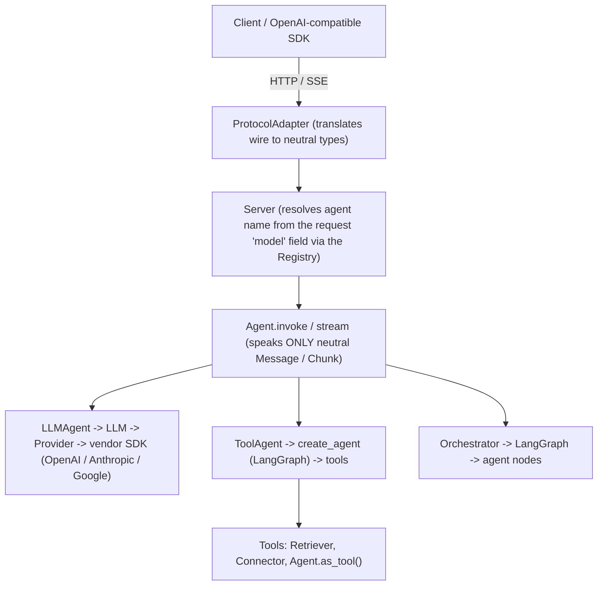
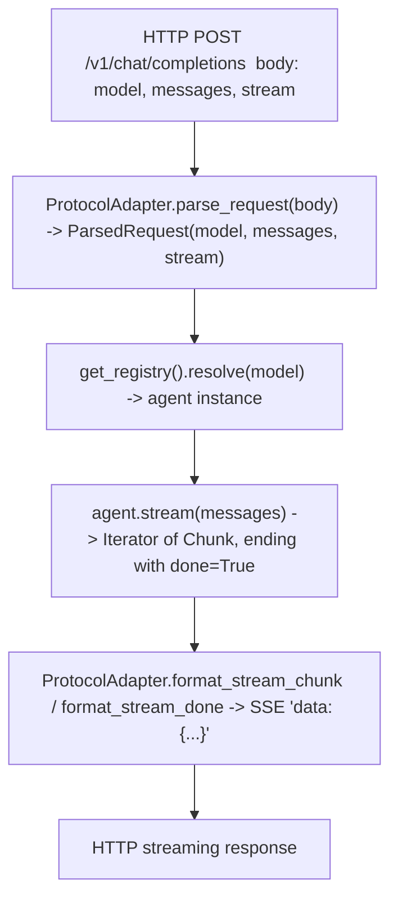
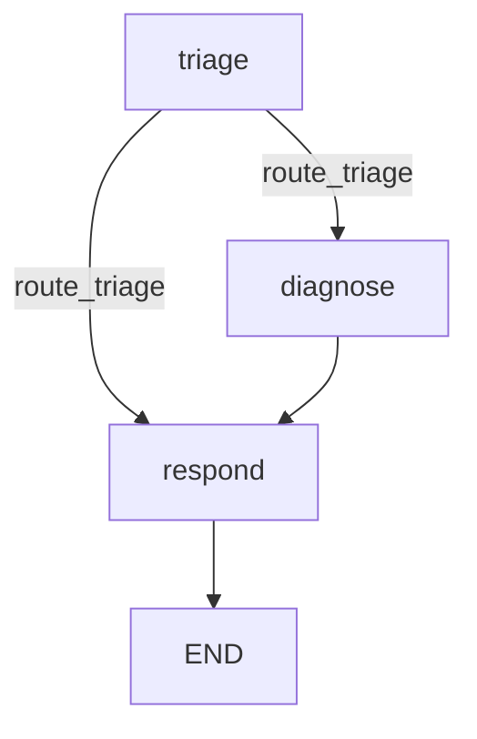
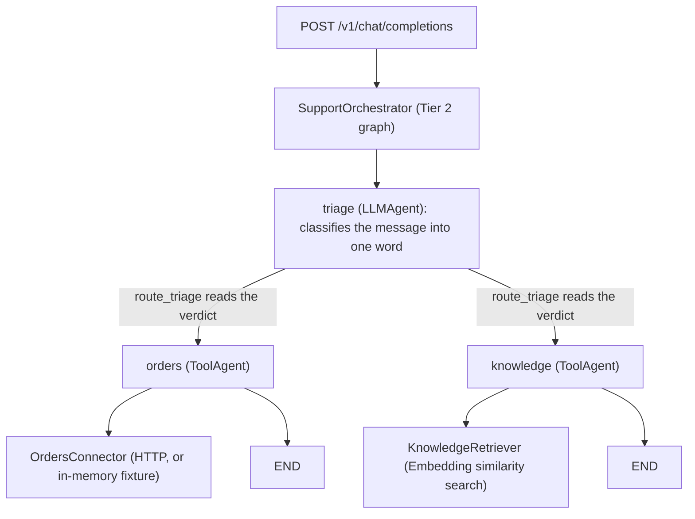

# aixon Framework - RAG Knowledge Base

> **What this file is.** A self-contained, retrieval-ready knowledge base about the **aixon** framework. It is meant to be ingested into a vector store and consumed by an AI agent operating with RAG (Retrieval-Augmented Generation) contexts: when the agent is asked about aixon, it retrieves the relevant sections below and grounds its answer in them. Every section is written to be self-contained, so it survives chunking and retrieves well on its own.
> **How an agent should use it.** Treat every section as authoritative reference for aixon version 0.1.1. Quote APIs, class names, attributes, and code exactly as written here; do not invent behavior that is not described. Map the question to a topic (agents, LLM, tools, orchestrator, retrieval, server, CLI, async, errors), retrieve that section, and answer from it. For "how do I..." questions, the FAQ (section 25) and the complete worked example (section 26) are the best starting points.
> **Framework version documented:** 0.1.1
> **Code and API identifiers are always in English.** Python required: 3.11 or newer. PyPI package: `aixon` (`pip install aixon`). License: MIT.

---

## 1. What aixon is

aixon is a Python framework for building AI-agent systems. The central idea is declarative: you build an agent by subclassing one of three concrete agent types and setting class attributes (`llm`, `prompt`, `tools`, and so on). The class registers itself the moment Python evaluates its body, so there is no central wiring file and no routing table to maintain.

There are three building blocks of behavior:

| Building block | Purpose |
|---|---|
| `LLMAgent` | A single, direct LLM call (no tool loop). |
| `ToolAgent` | An LLM plus a tool-calling loop (built on LangGraph's `create_agent`). |
| `Orchestrator` | Multiple agents coordinated by a graph (supervisor, explicit graph, or raw LangGraph). |

Everything is an `Agent` with one uniform interface (`invoke`, `stream`, `ainvoke`, `astream`, `as_tool`). Because the interface is uniform, agents compose freely: a `ToolAgent` can be a node in an `Orchestrator`, an `Orchestrator` can be a tool inside a `ToolAgent`, and the `Server` never needs to know which subtype it is calling.

aixon is built on LangChain 1.x and LangGraph 1.x (mandatory core dependencies). Optional extras add the outer layers (server, CLI, provider bindings, vendor retrievers).

### 1.1 The key design principle: the neutral boundary

Every agent speaks only two neutral types at its boundary: a list of `Message` objects in, and a `Message` (or a stream of `Chunk` objects) out. No provider type (such as `langchain_openai.ChatOpenAI`) and no wire type (such as an OpenAI JSON request body) ever crosses into an agent's runtime. Protocol adapters translate on the outside; provider SDKs stay hidden inside the `LLM` object.

What this buys you:

- A `ToolAgent` can swap its LLM from OpenAI to Anthropic without touching the `Orchestrator` that calls it as a node.
- The `Server` can mount a new `ProtocolAdapter` (a new wire format) without touching any `Agent`.
- Agents are testable with plain `Message` objects: no HTTP, no provider mocks required.

---

## 2. Architecture

The system is layered. Each layer depends only on the layer directly below it. Provider SDKs, LangChain internals, and wire-format objects are contained within their layer and never cross upward.



> Explanation: a request enters as HTTP or SSE and hits a `ProtocolAdapter`, which converts the wire body into neutral `Message` objects. The `Server` resolves which agent to run by looking up the request's `model` field in the `Registry`. From that point inward, only neutral types travel: the agent runs and returns a `Message` (or streams `Chunk` deltas). Whatever the agent is internally (a single LLM call, a tool loop, or an orchestrated graph), the layers above never change. Provider SDKs live only inside `LLM`; wire formats live only inside the adapter.

### 2.1 Request flow, end to end



> Explanation: the adapter parses the wire body into a `ParsedRequest` (which carries the neutral `messages`, the requested `model` name, and the `stream` flag). The `Server` resolves the agent by name or alias, then calls `stream` (or `invoke` for non-streaming). The agent yields neutral `Chunk` deltas, which the adapter re-encodes into the wire's streaming format. The `Server` itself is dialect-agnostic; every wire detail lives in the adapter.

---

## 3. Installation and optional extras

The core install (`pip install aixon`) brings LangChain and LangGraph, so agents work out of the box. Optional extras add the outer layers.

```bash
pip install aixon                      # core: langchain + langgraph
pip install "aixon[server]"            # FastAPI + uvicorn + httpx - serve agents as an API
pip install "aixon[cli]"               # click + openai - the `aixon` command + remote chat
pip install "aixon[openai]"            # OpenAI provider binding (langchain-openai)
pip install "aixon[anthropic]"         # Anthropic provider binding
pip install "aixon[google]"            # Google provider binding (Gemini)
pip install "aixon[retrieval]"         # httpx - Connector / HttpToolConnector
pip install "aixon[openai-embedding]"  # langchain-openai - OpenAIEmbedding
pip install "aixon[weaviate]"          # Weaviate vector-store Retriever
pip install "aixon[ragie]"             # Ragie managed-RAG Retriever
pip install "aixon[tavily]"            # Tavily web-search Retriever
pip install "aixon[rerank]"            # flashrank reranking (for Weaviate)
pip install "aixon[tiktoken]"          # token counting for the server `usage` field
pip install "aixon[all]"               # everything above
```

### 3.1 Dependency summary (aixon 0.1.1)

| Dependency | Version | Layer |
|---|---|---|
| langchain | >= 1.0 | core |
| langchain-core | >= 1.0 | core |
| langgraph | >= 1.0 | core |
| fastapi / uvicorn / pydantic | current | server extra |
| httpx | >= 0.27 | server / retrieval extra |
| click / openai | current | cli extra |
| langchain-openai | >= 0.2 | openai / openai-embedding extra |
| langchain-anthropic | >= 0.2 | anthropic extra |
| langchain-google-genai | >= 2.0 | google extra |
| weaviate-client / langchain-weaviate | current | weaviate extra |
| ragie | >= 2 | ragie extra |
| tavily-python | >= 0.7 | tavily extra |
| flashrank | >= 0.2 | rerank extra |
| tiktoken | >= 0.7 | tiktoken extra |

aixon ships type hints (PEP 561 `py.typed`), so type checkers see real types.

---

## 4. The public API surface

Everything below is importable directly from `aixon`, for example `from aixon import LLMAgent, LLM, ToolAgent`.

| Group | Names |
|---|---|
| Foundation | `Agent`, `AgentTool`, `autodiscover`, `Message`, `Chunk`, `Role`, `Registry`, `get_registry`, `reset_registry`, `Logger` |
| Errors | `AixonError`, `AgentNotFoundError`, `CompositionCycleError`, `NamingError`, `RegistrationError` |
| LLM and providers | `LLM`, `LLMAgent`, `Provider`, `get_provider`, `register_provider` |
| Reasoning and tools | `emit_reasoning`, `reasoning_channel`, `ToolAgent` |
| Orchestration | `Orchestrator`, `GraphState`, `END` (last two also in `aixon.state`) |
| Retrieval / connectors / embeddings | `Connector`, `HttpToolConnector`, `Embedding`, `OpenAIEmbedding`, `Retriever`, `TypeAccess`, `TavilyRetriever`, `RagieRetriever`, `WeaviateRetriever` |
| Server (requires `aixon[server]`) | `Server`, `ProtocolAdapter`, `OpenAIAdapter`, `AnthropicAdapter`, `ParsedRequest` |

---

## 5. The neutral types: Message and Chunk

These are the only two types that cross an agent's boundary. They are defined in `aixon/message.py`.

```python
from dataclasses import dataclass, field
from typing import Any, Literal, Optional

Role = Literal["system", "user", "assistant", "tool"]

@dataclass
class Message:
    role: Role
    content: str = ""
    name: Optional[str] = None
    tool_calls: list[dict[str, Any]] = field(default_factory=list)
    tool_call_id: Optional[str] = None
    reasoning: Optional[str] = None

    def to_dict(self) -> dict[str, Any]: ...   # omits empty optional fields

@dataclass
class Chunk:
    content: str = ""
    reasoning: str = ""
    done: bool = False
```

> Explanation: a `Message` carries one conversation turn (its `role` is one of `system`, `user`, `assistant`, `tool`). A `Chunk` is a streaming delta: `content` and `reasoning` are additive text fragments, and the final `Chunk` in a stream has `done=True`. After a non-streaming `invoke`, an agent's chain-of-thought is available on `Message.reasoning`.

Example: building messages by hand.

```python
from aixon import Message

msgs = [
    Message(role="system", content="You are concise."),
    Message(role="user", content="Plan a product launch."),
]
```

> Explanation: most of the time you build a list like this and pass it to `agent.invoke(msgs)` or `agent.stream(msgs)`. A leading `system` message overrides the agent's declared `prompt` for that call.

---

## 6. The Agent interface (uniform across all subtypes)

Every agent (`LLMAgent`, `ToolAgent`, `Orchestrator`, or your own `Agent` subclass) exposes the same five methods:

```python
agent.invoke(messages: list[Message])  -> Message
agent.stream(messages: list[Message])  -> Iterator[Chunk]
agent.ainvoke(messages: list[Message]) -> Message              # async
agent.astream(messages: list[Message]) -> AsyncIterator[Chunk] # async
agent.as_tool(name=None, description=None) -> AgentTool
```

Example: invoke (returns one `Message`).

```python
from aixon.message import Message

reply = PlannerAgent().invoke([Message(role="user", content="Plan a product launch")])
print(reply.content)
```

> Explanation: `invoke` runs the agent to completion and returns a single `Message`. Use it for request/response style code where you want the full answer at once.

Example: stream (yields `Chunk` deltas).

```python
for chunk in ResearchAgent().stream([Message(role="user", content="Latest on LLMs")]):
    if chunk.reasoning:
        print("[reasoning]", chunk.reasoning)
    elif chunk.content:
        print(chunk.content, end="", flush=True)
```

> Explanation: `stream` yields incremental `Chunk` objects. A chunk may carry `content` (the answer text), `reasoning` (the agent's thinking, see section 10), or `done=True` at the end. This is what powers token-by-token UIs.

### 6.1 Common attributes (available on every agent subtype)

| Attribute | Type | Default | Description |
|---|---|---|---|
| `name` | `str` | class name lowercased | Registry key and API `model` field. |
| `description` | `str` | `""` | Human-readable purpose; shown in `aixon list` and the chat menu. |
| `aliases` | `list[str]` | `[]` | Alternate registry names (resolvable like `name`). |
| `hidden` | `bool` | `False` | Exclude from `get_registry().public()` and the `aixon chat` menu (still callable). |
| `owned_by` | `str` | `"aixon"` | Shown in the `/v1/models` response. |

---

## 7. LLMAgent: a direct LLM call

Use `LLMAgent` for a single LLM call with no tool loop: the simplest path from question to answer.

```python
from aixon import LLMAgent, LLM

class PlannerAgent(LLMAgent):
    llm         = LLM("gpt-4o-mini", temperature=0.2)
    description = "Breaks complex goals into step-by-step plans"
    prompt      = "You are a concise strategic planner. Use numbered lists."
```

> Explanation: subclass `LLMAgent`, give it an `llm` and (optionally) a `prompt`. The class auto-registers under the name `planneragent` (the class name lowercased). The name must end with `Agent` (see section 19). `invoke` prepends the `prompt` as a system message and calls the model; `stream` yields the answer as `Chunk` deltas.

LLMAgent attributes (in addition to the common ones in section 6.1):

| Attribute | Type | Required | Description |
|---|---|---|---|
| `llm` | `LLM` | Yes | The language model. A missing `llm` on a concrete subclass raises `AixonError` at import time. |
| `prompt` | `str` | No | System prompt prepended to every `invoke` / `stream` call. |

More LLMAgent examples:

```python
from aixon import LLMAgent, LLM

class SummarizerAgent(LLMAgent):
    llm = LLM("gpt-4o-mini", temperature=0.0)
    description = "Summarizes text into three bullet points"
    prompt = "Summarize the user's text into exactly three bullet points."

class TranslatorAgent(LLMAgent):
    llm = LLM("claude-3-5-haiku-20241022", provider="anthropic")
    description = "Translates English to Portuguese"
    prompt = "Translate the user's message into Brazilian Portuguese. Output only the translation."
```

> Explanation: each class is a complete, independent agent. `SummarizerAgent` uses `temperature=0.0` for deterministic output; `TranslatorAgent` uses an Anthropic model. Neither needs a tool because the task is a single model call. The choice of provider is local to each `LLM(...)` and does not affect any other agent.

---

## 8. LLM: declaring a language model

`LLM` is a lazy, declarative handle for a chat model. It builds the underlying LangChain `BaseChatModel` only on first use, so constructing an agent never requires a network call or an API key at import time.

```python
from aixon import LLM

# Provider inferred from the model name prefix:
llm = LLM("gpt-4o-mini", temperature=0.2, max_tokens=4096)

# Explicit provider override:
llm = LLM("claude-3-5-haiku-20241022", provider="anthropic", temperature=0.3)
```

> Explanation: generation parameters such as `temperature`, `max_tokens`, and `top_p` are passed straight through to the model. The model name's prefix selects the provider automatically, unless you pass `provider=` to override.

### 8.1 Provider inference table (model prefix to provider)

| Model prefix | Provider name |
|---|---|
| `gpt-*`, `o[0-9]*`, `text-*` | `"openai"` |
| `claude-*` | `"anthropic"` |
| `gemini-*` | `"google"` |

Provider names are lowercase strings, not an enum. To override inference, pass `provider=` explicitly, for example `LLM("some-model", provider="openai")`.

### 8.2 Custom provider

For a custom backend, subclass the `Provider` ABC and register a single instance before first use.

```python
from aixon.providers.base import Provider, register_provider

class MyProvider(Provider):
    name    = "myvendor"
    env_key = "MYVENDOR_API_KEY"

    def build(self, model: str, **params):
        from my_sdk import ChatModel        # lazy import
        return ChatModel(model=model, **params)

register_provider(MyProvider())             # one instance, keyed by .name
# then: LLM("my-model", provider="myvendor")
```

> Explanation: a `Provider` is a factory. Its `build` method returns a LangChain `BaseChatModel` for a given model name. `register_provider` stores the instance keyed by `.name`. After registration, any `LLM(..., provider="myvendor")` uses it. The vendor SDK import is lazy (inside `build`) so importing the module never forces the SDK to be installed.

A complete, runnable custom provider (an offline, deterministic chat model, useful for tests or demos):

```python
from langchain_core.language_models.chat_models import BaseChatModel
from langchain_core.messages import AIMessage
from langchain_core.outputs import ChatGeneration, ChatResult
from aixon.providers.base import Provider, register_provider

class DemoChatModel(BaseChatModel):
    @property
    def _llm_type(self) -> str:
        return "demo"

    def _generate(self, messages, stop=None, run_manager=None, **kwargs) -> ChatResult:
        msg = AIMessage(content="a deterministic reply")
        return ChatResult(generations=[ChatGeneration(message=msg)])

class DemoProvider(Provider):
    name    = "demo"
    env_key = ""   # no API key needed
    def build(self, model: str, **params) -> BaseChatModel:
        return DemoChatModel()

register_provider(DemoProvider())
# then: LLM("demo-1", provider="demo")
```

> Explanation: `DemoChatModel` is a real LangChain chat model that returns a fixed answer. `DemoProvider.build` returns it. Because `env_key` is empty, no API key is needed. This pattern lets a whole agent system run offline (the complete example in section 25 uses exactly this technique).

---

## 9. ToolAgent: LLM plus tool-calling loop

Use `ToolAgent` when an agent needs to call external functions, query a `Retriever`, or invoke another agent as a tool, then loop until it has a final answer. It is built on `langchain.agents.create_agent` (LangGraph) and speaks only neutral `Message` / `Chunk` at its boundary.

```python
from aixon import ToolAgent, LLM
from langchain_community.tools import DuckDuckGoSearchRun  # pip install langchain-community
from retrievers.library import LibraryRetriever

class ResearchAgent(ToolAgent):
    llm                = LLM("gpt-4o-mini", temperature=0.1)
    description        = "Researches topics using web search and the knowledge base"
    prompt             = "Always cite your sources. Think step by step."
    tools              = [LibraryRetriever, DuckDuckGoSearchRun()]
    max_iterations     = 15
    max_execution_time = 600
```

> Explanation: the `tools` list mixes a retriever and a LangChain community tool. At runtime the model decides which tools to call and in which order, loops up to `max_iterations` times, then produces a final answer. The whole loop runs inside LangGraph but you never touch LangGraph directly.

ToolAgent attributes (in addition to the common ones in section 6.1):

| Attribute | Type | Default | Description |
|---|---|---|---|
| `llm` | `LLM` | Required | The language model driving the loop. |
| `prompt` | `str` | `""` | System prompt. |
| `tools` | `list` | `[]` | Mix of `AgentTool`, `Retriever`, LangChain `@tool` functions, or any callable. All coerced to a LangChain tool internally via `coerce_tools`. |
| `max_iterations` | `int` | `15` | Maximum tool-call rounds (maps to LangGraph's `recursion_limit` as `2 * max_iterations + 1`). |
| `max_execution_time` | `int` | `600` | Wall-clock timeout in seconds (deadline semantics below). |
| `tool_call_label` | `str` | `"Calling {name}..."` | A `{name}`-templated reasoning label emitted before each tool call. Override for a friendlier phrase or for localization, for example `"Chamando {name}..."`. Added in aixon 0.1.1. |

### 9.1 Tool coercion: what counts as a tool

Anything in `tools` is normalized at runtime:

| Tool form | How it is coerced |
|---|---|
| An `AgentTool` (from `Agent.as_tool()` or `Retriever.as_tool()`) | wrapped as a `StructuredTool` |
| A LangChain `BaseTool` or `@tool`-decorated function | passed through unchanged |
| A plain callable (a function or bound method) | wrapped via `StructuredTool.from_function` |

So you can mix library tools, custom functions, retrievers, and other agents freely:

```python
def get_weather(city: str) -> str:
    """Return the current weather for a city."""
    return f"Sunny in {city}."

class AssistantAgent(ToolAgent):
    llm   = LLM("gpt-4o-mini")
    tools = [
        get_weather,                                   # plain callable
        LibraryRetriever().as_tool(k=10),              # retriever as a tool
        PlannerAgent().as_tool(description="Plan it"), # another agent as a tool
    ]
```

> Explanation: `get_weather` is a plain function with a docstring (the docstring becomes the tool description the model sees). `LibraryRetriever().as_tool(k=10)` turns a retriever into a search tool that returns the top 10 results. `PlannerAgent().as_tool(...)` turns an entire agent into a tool. All three are coerced uniformly, so the model can call any of them in its loop.

### 9.2 Customizing the per-tool reasoning label (tool_call_label)

Before each tool call, a `ToolAgent` emits a reasoning label. The default is `"Calling {name}..."`. Override the `tool_call_label` class attribute (a `{name}`-templated string) for a friendlier phrase or for localization.

```python
class DiagnosisAgent(ToolAgent):
    llm   = LLM("gpt-4o-mini")
    tools = [check_battery]
    tool_call_label = "Chamando {name}..."   # emits, e.g., "Chamando check_battery..."
```

> Explanation: when the agent calls the `check_battery` tool, it emits a reasoning line "Chamando check_battery..." instead of the English default. The `{name}` placeholder is replaced with the tool name. This attribute was added in version 0.1.1; before it, the label was hard-coded.

### 9.3 Deadline semantics

`max_execution_time` is a wall-clock deadline, not an interrupt. On the sync path, `invoke` checks it after the run completes and raises `AixonError` if exceeded; `stream` checks it between updates. Neither can abort a single in-flight tool call. On the async path, the deadline is enforced with `asyncio.wait_for`, so an overrun is cancelled at the next await point, provided the chain is genuinely async (an async model, async tools). See section 20.

---

## 10. Nesting agents as tools (as_tool) and the AgentTool type

Any `Agent` exposes itself as a tool via `as_tool()`. The result is a neutral `AgentTool`.

```python
from dataclasses import dataclass
from typing import Awaitable, Callable

@dataclass
class AgentTool:
    name: str
    description: str
    func: Callable[[str], str]
    coroutine: Callable[[str], Awaitable[str]] | None = None  # optional async path
```

Example: composing agents.

```python
from aixon import ToolAgent, LLM

class OrchestratorAgent(ToolAgent):
    llm   = LLM("gpt-4o-mini")
    tools = [
        PlannerAgent().as_tool(description="Break the goal into steps"),
        ResearchAgent().as_tool(),
    ]
```

> Explanation: `as_tool()` wraps `agent.invoke`. Each tool call creates a fresh `[Message(role="user", content=text)]`, so the wrapped agent's state never leaks between calls. `as_tool()` also sets `coroutine` (wrapping `ainvoke`), which makes the tool dual: `coerce_tools` registers both, so the tool runs on the sync path (`invoke` to `func`) and the async path (`ainvoke` to `coroutine`). The same `AgentTool` shape is returned by `Retriever.as_tool()`, so `ToolAgent.tools` handles agents and retrievers uniformly.

> Explanation (reasoning propagation): when a nested agent emits reasoning (via the ReasoningChannel, section 10/11), that reasoning bubbles up through the outer `stream()` as `Chunk(reasoning=...)` deltas. Callers therefore see the full chain of thought across nesting levels.

---

## 11. Reasoning: emit_reasoning, the ReasoningChannel, and thought_stream_mode

aixon surfaces an agent's thinking through a contextvars-based ReasoningChannel. A `ToolAgent` emits a label per tool call (see `tool_call_label`), and any code running inside an agent can push a reasoning line with `emit_reasoning`.

```python
from aixon import ToolAgent, emit_reasoning
from connectors.orders import OrdersConnector, extract_order_id

_orders = OrdersConnector()

def order_status(order_query: str) -> str:
    """Look up an order's status. Accepts an order id or free text mentioning one."""
    order_id = extract_order_id(order_query)
    if not order_id:
        return "No order number found. Please include your order id."
    emit_reasoning(f"Looking up order {order_id} in the orders service...")  # surfaces as reasoning
    order = _orders.lookup_order(order_id)
    return f"Order {order['order_id']}: status '{order['status']}'."

class OrdersAgent(ToolAgent):
    llm   = LLM("gpt-4o-mini")
    tools = [order_status]
```

> Explanation: inside the `order_status` tool, `emit_reasoning(...)` pushes a human-readable line into the active reasoning channel. In `invoke()` this reasoning ends up on `Message.reasoning`; in `stream()` it is yielded as `Chunk(reasoning=...)` deltas. Reasoning from nested agents bubbles up to the outermost stream, so the caller sees a complete thought trace.

### 11.1 thought_stream_mode (server, OpenAI adapter)

When serving over the OpenAI adapter, a per-request `thought_stream_mode` field controls how reasoning reaches the wire on a stream:

| Mode | Behavior |
|---|---|
| `content` (default) | Reasoning wrapped in a `<think>...</think>` block inside `delta.content` (how most OpenAI UIs render thinking). |
| `custom` | Reasoning on a separate `delta.reasoning` field. |
| `hidden` | Reasoning dropped; content only. |

---

## 12. Orchestrator: multi-agent coordination

`Orchestrator` is the `Agent` subtype for coordinating multiple agents. Like all agents it exposes `invoke`, `stream`, and `as_tool`, so an orchestrator can be a node inside another orchestrator, a tool inside a `ToolAgent`, or the top-level entry served by the `Server`.

Three tiers handle increasing complexity. Pick the lowest tier that covers your case.

```python
from aixon import Orchestrator, LLM
from aixon.state import END, GraphState
```

### 12.1 Tier 1: Supervisor (default, natural-language routing)

An LLM decides which worker agent handles each turn and loops until it decides the conversation is complete.

```python
class SupportOrchestrator(Orchestrator):
    description = "Routes support tickets to the right specialist"
    supervisor  = LLM("gpt-4o-mini")                       # routes each turn to a worker
    agents      = [BillingAgent, TechAgent, PlannerAgent]  # your LLMAgent / ToolAgent classes
```

> Explanation: the supervisor LLM receives the conversation history plus the list of workers (names and descriptions), selects the next worker, routes the turn, and decides whether to call another worker or return the final answer. Use Tier 1 when routing is best expressed in natural language ("send billing questions to BillingAgent").

### 12.2 Tier 2: Explicit graph (deterministic routing in code)

Use Tier 2 when routing is deterministic (or conditionally deterministic) and you want it in code.

```python
class TriageOrchestrator(Orchestrator):
    description = "Triages issues with conditional routing"

    nodes = {
        "triage":   TriageAgent,
        "diagnose": DiagnosisAgent,
        "respond":  PlannerAgent,
    }
    entry = "triage"
    edges = [
        ("diagnose", "respond"),
        ("respond",  END),
    ]

    def route_triage(self, state) -> str:
        return "diagnose" if state["needs_diagnosis"] else "respond"
```

The graph this declares:



> Explanation: `entry` determines the first node. The `edges` list is wiring, not a sequence: the order of tuples is irrelevant to execution order. Trace the graph by following `entry`, then each node's exit. Here `triage` runs first; `route_triage` chooses `diagnose` or `respond`; if `diagnose` ran, the fixed edge sends it to `respond`; `respond` ends the graph at `END`.

Node exit forms (each node has exactly one):

| Exit form | How to declare |
|---|---|
| Fixed (unconditional) edge | A tuple `(node, dst)` in `edges`. |
| Conditional or fan-out | A `route_<node>` method. |

> Explanation: declaring both for the same node raises `AixonError` at import time (ambiguous exit). Declaring neither makes the node terminal (equivalent to going to `END`). `END` is a sentinel imported from `aixon.state`.

Two kinds of branching via `route_<node>`:

```python
# 1. Conditional - return a single node name:
def route_triage(self, state) -> str:
    return "diagnose" if state["needs_diagnosis"] else "respond"

# 2. Fan-out - return a list; all run in parallel, graph waits for all:
def route_research(self, state) -> list[str]:
    return ["web_search", "knowledge_base", "internal_docs"]
```

> Explanation: a `route_<node>` method returning a string picks one next node. Returning a list runs all listed nodes in parallel and waits for all of them before continuing.

### 12.3 Tier 3: LangGraph escape hatch

Override `build_graph` and return a compiled LangGraph graph. Use this only when Tier 2's declarative surface cannot express the graph (dynamic nodes, native subgraphs, custom reducers, intentional cycles).

```python
class WeirdOrchestrator(Orchestrator):
    description = "Custom graph with cycles and conditional edges"

    def build_graph(self):
        from langgraph.graph import StateGraph
        g = StateGraph(self.State)
        g.add_node("analyze", AnalysisAgent().invoke)
        g.add_node("refine",  RefineAgent().invoke)
        g.add_conditional_edges("analyze", lambda s: "refine" if s["needs_refinement"] else END)
        g.add_edge("refine", "analyze")   # a legitimate cycle inside the graph
        g.set_entry_point("analyze")
        return g.compile()
```

> Explanation: this returns a raw compiled LangGraph graph, including a deliberate cycle (`refine` back to `analyze`). aixon runs it as-is. A cycle inside a single graph is legitimate and bounded by `recursion_limit` (section 12.6).

### 12.4 Tier detection order

aixon detects the tier in this order:

1. `build_graph` is overridden -> Tier 3.
2. `nodes` is non-empty -> Tier 2.
3. `supervisor` and `agents` are set -> Tier 1.
4. None of the above on a concrete subclass -> `AixonError` at import time.

### 12.5 State

`GraphState` is the default state type. It carries `messages` and `reasoning`.

```python
from aixon.state import GraphState

class GraphState(TypedDict, total=False):
    messages:  Annotated[list[Message], add_messages_neutral]
    reasoning: list[str]
```

Add fields by nesting a `State` class:

```python
class TriageOrchestrator(Orchestrator):
    class State(GraphState):
        needs_diagnosis: bool = False

    def route_triage(self, state) -> str:
        return "diagnose" if state["needs_diagnosis"] else "respond"
```

> Explanation: nest a `State` subclass to add typed fields your routing logic needs. The `route_<node>` methods receive this extended state, so `state["needs_diagnosis"]` is available.

### 12.6 Recursion guards

Guard A: composition cycle detection (always on). A composition cycle is when agent A uses B as a tool and B uses A (directly or transitively). aixon walks the composition graph in `__init_subclass__`; if a class appears twice on a path, it raises `CompositionCycleError` at import time.

```python
class PingAgent(ToolAgent):
    llm   = LLM("gpt-4o-mini")
    tools = [PongAgent().as_tool()]   # CompositionCycleError if PongAgent uses PingAgent

class PongAgent(ToolAgent):
    llm   = LLM("gpt-4o-mini")
    tools = [PingAgent().as_tool()]   # closes the cycle
```

> Explanation: this pair would expand forever at build time, so aixon rejects it before the server starts. A cycle inside a single LangGraph graph (Tier 3) is different and allowed, because it is bounded by Guard B.

Guard B: runtime depth and loop limit (declarative).

```python
class ResearchOrchestrator(Orchestrator):
    supervisor      = LLM("gpt-4o-mini")
    agents          = [SearchAgent, SummarizeAgent]
    recursion_limit = 50    # LangGraph supersteps. Default: 25. None = no cap.
    timeout         = 600   # Wall-clock deadline in seconds. None = no deadline.
```

> Explanation: `recursion_limit` is the real guard against runaway loops (passed to LangGraph's compiled graph). `timeout` is a post-hoc deadline: `invoke` checks it after the graph returns and raises `AixonError` if exceeded; it does not interrupt an in-flight node. Setting both to `None` is allowed but not recommended.

### 12.7 Orchestrator as a tool or node

```python
class RouterAgent(ToolAgent):
    llm   = LLM("gpt-4o-mini")
    tools = [SupportOrchestrator().as_tool(description="Handle support tickets")]
```

> Explanation: because `Orchestrator` implements the full `Agent` interface, an orchestrator can be a tool inside a `ToolAgent` (as here) or a node inside another orchestrator. Each `invoke` on the wrapped orchestrator gets its own state, so conversation history never leaks between calls.

---

## 13. Retriever: context search

`Retriever` is the base class for context search: vector stores, web search, hybrid retrievers, or any source that returns ranked text chunks.

```python
from aixon import Retriever, TypeAccess

class LibraryRetriever(Retriever):
    description = "Searches the internal knowledge base"
    type_access = TypeAccess.READ

    def search(self, query: str, *, k: int | None = None) -> list[dict]:
        # Return [{"text": str, "metadata": dict}, ...]
        results = self._vector_store.similarity_search(query, k=k or 5)
        return [{"text": r.page_content, "metadata": r.metadata} for r in results]
```

> Explanation: implement `search` to return a list of `{"text": ..., "metadata": ...}` dicts. The class name must end with `Retriever` (else `NamingError` at import time). Unlike agents, retrievers are not added to the agent registry; they are tools consumed by agents via `as_tool()`, so they never appear in `aixon list`. Install with `pip install "aixon[retrieval]"`.

### 13.1 Retriever API

```python
class Retriever(ABC):
    description: str = ""
    type_access: TypeAccess = TypeAccess.READ

    @abstractmethod
    def search(self, query: str, *, k: int | None = None) -> list[dict]:
        """Return [{"text": str, "metadata": dict}, ...]."""

    async def asearch(self, query: str, *, k: int | None = None) -> list[dict]:
        """Async search. Default bridges to search() in a thread; override for a
        native async SDK (true non-blocking I/O)."""

    def write(self, texts: list[str], metadatas: list[dict] | None = None) -> list[str]:
        """Store documents. Raises AixonError if type_access is READ."""

    def as_tool(self, name=None, description=None, k=None) -> AgentTool:
        """Expose as a neutral AgentTool (same shape as Agent.as_tool())."""
```

> Explanation: only `search` is required. `asearch` is optional; its default runs `search` in a worker thread, so every retriever works on the async agent path without blocking the event loop. `as_tool()` returns a dual `AgentTool` (sync `func` to `search`, async `coroutine` to `asearch`), so the retriever tool runs on both `invoke` and `ainvoke`.

### 13.2 TypeAccess

```python
from aixon import TypeAccess

class TypeAccess(Enum):
    READ  = "read"   # search only; write() raises
    WRITE = "write"  # write only (indexing pipeline)
    ALL   = "all"    # both search and write
```

### 13.3 Using a Retriever as a tool

```python
from aixon import LLM, ToolAgent

class ResearchAgent(ToolAgent):
    llm   = LLM("gpt-4o-mini")
    tools = [
        LibraryRetriever().as_tool(k=10),
        PlannerAgent().as_tool(),
    ]
```

> Explanation: `as_tool(k=10)` produces a search tool that returns the top 10 hits. When the retriever returns no results, the tool yields the string `"No results found for query: '<query>'"`.

### 13.4 Writing to a Retriever

Set `type_access = TypeAccess.ALL` and override `write()`.

```python
from aixon import Retriever, TypeAccess

class IndexRetriever(Retriever):
    type_access = TypeAccess.ALL

    def search(self, query: str, *, k: int | None = None) -> list[dict]:
        ...

    def write(self, texts: list[str], metadatas: list[dict] | None = None) -> list[str]:
        ids = self._vector_store.add_texts(texts, metadatas=metadatas or [{}] * len(texts))
        return ids

retriever = IndexRetriever()
ids = retriever.write(
    texts=["The battery should be replaced every 2 years."],
    metadatas=[{"source": "manual", "page": 42}],
)
```

> Explanation: `write` is only allowed when `type_access` is `WRITE` or `ALL`. Calling `write()` on a `READ` retriever raises `AixonError`. This is how you build an indexing pipeline that both ingests and serves documents.

---

## 14. Vendor retrievers: Tavily, Ragie, Weaviate

aixon ships three vendor-backed `Retriever` bases. Each is generic (configured by class attributes and environment variables), lazy (the vendor SDK is imported only on use), and hidden behind an optional extra. Importing aixon never requires the vendor SDK; instantiating or using without it raises a clear `ImportError` naming the extra. Vendor retrievers also do not validate API keys at construction time, so you can declare them in a class body at import or autodiscover time without keys present.

| Retriever | Extra | Backend | Async |
|---|---|---|---|
| `TavilyRetriever` | `aixon[tavily]` | Tavily web search | native (`AsyncTavilyClient`) |
| `RagieRetriever` | `aixon[ragie]` | Ragie managed RAG | native (`retrieve_async`) |
| `WeaviateRetriever` | `aixon[weaviate]` (plus `aixon[rerank]`) | Weaviate vector store | thread-bridge |

### 14.1 TavilyRetriever (web search)

```python
from aixon import TavilyRetriever

class WebRetriever(TavilyRetriever):
    description     = "Search the web for fresh information."
    max_web_results = 5
```

> Explanation: read-only web search. The API key comes from the `api_key` argument or the `TAVILY_API_KEY` environment variable. It returns one document for the AI answer (when present) plus one per result.

### 14.2 RagieRetriever (managed RAG)

```python
from aixon import RagieRetriever

class KbRetriever(RagieRetriever):
    description = "Search the managed knowledge base."
    partition   = "knowledge-base"
```

> Explanation: managed RAG, where Ragie handles chunking, embedding, and indexing. The API key comes from the `api_key` argument or `RAGIE_API_KEY`. Set `rerank = True` for Ragie's native reranking. Set `type_access = TypeAccess.ALL` to enable `write()` (it ingests via `create_raw`).

### 14.3 WeaviateRetriever (vector store)

```python
from aixon import OpenAIEmbedding, WeaviateRetriever, TypeAccess

class LibraryRetriever(WeaviateRetriever):
    description     = "Search the technical library."
    collection_name = "Library"
    embedding       = OpenAIEmbedding("text-embedding-3-large")
    type_access     = TypeAccess.READ
```

> Explanation: vector-store retrieval. The neutral `aixon.Embedding` is bridged to LangChain internally. The connection is lazy (opened on first `search` or `write`), so instantiation is safe at import or autodiscover time. Connection comes from `host` / `port` arguments or `WEAVIATE_HOST` / `WEAVIATE_PORT`.

Optional flashrank reranking (`pip install "aixon[rerank]"`):

```python
class DeepLibraryRetriever(WeaviateRetriever):
    description     = "Library with reranking."
    collection_name = "Library"
    embedding       = OpenAIEmbedding("text-embedding-3-large")
    rerank          = True   # needs aixon[rerank]
    rerank_fetch_k  = 25     # fetch wide
    rerank_top_k    = 10     # keep top N after rerank
```

> Explanation: with `rerank = True`, the retriever fetches `rerank_fetch_k` candidates and keeps the best `rerank_top_k` after reranking. `write()` (when `type_access` allows) chunks via `RecursiveCharacterTextSplitter` and supports deterministic IDs through `source_ids`.

---

## 15. Embedding: text embeddings

`Embedding` is the abstract base for vector-embedding providers. All network calls are lazy: no connection is made until `embed_*` is first invoked.

```python
from aixon import Embedding

class Embedding(ABC):
    @abstractmethod
    def embed_documents(self, texts: list[str]) -> list[list[float]]: ...
    @abstractmethod
    def embed_query(self, text: str) -> list[float]: ...
```

### 15.1 OpenAIEmbedding (built-in)

Install with `pip install "aixon[openai-embedding]"`.

```python
from aixon import OpenAIEmbedding

embedding = OpenAIEmbedding("text-embedding-3-small")
vectors   = embedding.embed_documents(["First document.", "Second document."])
query_vec = embedding.embed_query("What is the battery life?")

# Override which env var holds the API key:
embedding = OpenAIEmbedding("text-embedding-3-large", api_key_env="MY_OPENAI_KEY")
```

> Explanation: `embed_documents` embeds a batch of texts (for indexing); `embed_query` embeds a single query. By default the API key comes from `OPENAI_API_KEY`, but `api_key_env` lets you point at a different variable.

### 15.2 Custom embedding

```python
from aixon import Embedding

class LocalEmbedding(Embedding):
    def embed_documents(self, texts: list[str]) -> list[list[float]]:
        return [self._encode(t) for t in texts]
    def embed_query(self, text: str) -> list[float]:
        return self._encode(text)
    def _encode(self, text: str) -> list[float]:
        ...
```

> Explanation: implement both abstract methods to plug in a local or third-party embedding model. As long as both return float vectors, it is a drop-in replacement for `OpenAIEmbedding`.

---

## 16. Connector: external microservice client

`Connector` is a base HTTP client for calling external microservices. It reads its base URL and auth token from environment variables and exposes typed `get` / `post` (sync) and `aget` / `apost` (async) methods.

```python
from aixon import Connector

class InventoryConnector(Connector):
    base_url_env   = "INVENTORY_API_URL"
    auth_token_env = "INVENTORY_API_KEY"

    def get_stock(self, product_id: str) -> dict:
        return self.get(f"/products/{product_id}/stock")

    def reserve(self, product_id: str, qty: int) -> dict:
        return self.post("/reservations", json={"product_id": product_id, "qty": qty})
```

> Explanation: declare which environment variables hold the base URL and the Bearer token, then implement domain methods on top of `self.get` / `self.post`. The class name must end with `Connector` (else `NamingError`). `httpx` is imported lazily, so defining a subclass works on a bare install; the error only surfaces when `get()` or `post()` is actually called.

### 16.1 Connector API

```python
class Connector:
    base_url_env:   str = ""    # env var holding the service base URL
    auth_token_env: str = ""    # env var holding the auth token (Bearer)

    def __init__(self, *, base_url=None, auth_token=None, timeout=30.0): ...

    def get(self, path: str, **kw) -> dict: ...
    def post(self, path: str, json=None, **kw) -> dict: ...
    async def aget(self, path: str, **kw) -> dict: ...
    async def apost(self, path: str, json=None, **kw) -> dict: ...
```

> Explanation: `get` / `post` return parsed JSON dicts; non-2xx responses raise `httpx.HTTPStatusError`. Constructor keyword arguments (`base_url`, `auth_token`) take precedence over the environment variables, which is handy for tests.

### 16.2 Async connector

```python
class InventoryConnector(Connector):
    base_url_env = "INVENTORY_URL"

    async def get_stock(self, product_id: str) -> dict:
        return await self.aget(f"/products/{product_id}/stock")  # httpx.AsyncClient, non-blocking
```

> Explanation: `aget` / `apost` use `httpx.AsyncClient` so they do not block the event loop. Use them from an async tool or an agent's `ainvoke` path for real non-blocking I/O.

### 16.3 Using a Connector inside a ToolAgent

```python
from aixon import LLM, ToolAgent

class InventoryAgent(ToolAgent):
    llm   = LLM("gpt-4o-mini")
    tools = [
        InventoryConnector().get_stock,
        InventoryConnector().reserve,
    ]
```

> Explanation: a connector's methods are plain callables, so you pass them directly as tools; `ToolAgent` coerces them to LangChain tools. `HttpToolConnector` builds on `Connector` for HTTP-JSON tool servers.

---

## 17. Server: serving agents over an API

aixon ships a FastAPI/ASGI server (`Server`) backed by a pluggable `ProtocolAdapter` layer. Adapters translate wire formats to neutral `Message` / `Chunk`; agents never see a wire type. Install with `pip install "aixon[server]"`.

### 17.1 Quick start

```python
from aixon import Server, autodiscover

autodiscover("agents")           # register all agents
server = Server()                # default adapters: [OpenAIAdapter()]
server.serve(host="0.0.0.0", port=8000)
```

> Explanation: `autodiscover("agents")` imports every module under the `agents` package, which registers every agent. `Server()` with no arguments mounts the OpenAI adapter. `serve` starts uvicorn and blocks.

Production scaffold:

```python
from aixon import Server, autodiscover

autodiscover("agents")
server = Server()
app = server.app  # ASGI app - production: uvicorn main:app --workers 4

if __name__ == "__main__":
    server.serve(host="0.0.0.0", port=8000)
```

> Explanation: exposing `app = server.app` lets a production ASGI runner (uvicorn or gunicorn) import `main:app` and run multiple workers. The `if __name__` block keeps `python main.py` working for local runs.

### 17.2 Server class

```python
class Server:
    @classmethod
    def get_instance(cls) -> "Server": ...
    def __init__(self, adapters: list[ProtocolAdapter] | None = None):
        """Defaults to [OpenAIAdapter()] if adapters is None."""
    @property
    def app(self): ...               # the FastAPI ASGI application
    def serve(self, host="0.0.0.0", port=8000): ...  # start uvicorn; blocks
```

> Explanation: `Server` is a singleton. `Server.get_instance()` returns the existing instance or creates one. Adapters are fixed on first construction; later `Server(adapters=[...])` calls reuse the first instance's adapters.

Built-in route, always public and never requiring auth: `GET /health` returns `{"status": "healthy", "server": "aixon", "timestamp": "..."}`. The GET model-list routes from each adapter are also always public.

### 17.3 OpenAIAdapter (default)

Full OpenAI-compatible wire format. Routes:

| Route | Method | Description |
|---|---|---|
| `/v1/chat/completions` | POST | Non-streaming and streaming (SSE) completions. |
| `/chat/completions` | POST | Same, for clients that omit `/v1`. |
| `/v1/models` | GET | List registered agents in the OpenAI model object format. |
| `/models` | GET | Same, without `/v1`. |

Example: any OpenAI-compatible client works out of the box.

```python
from openai import OpenAI

client = OpenAI(base_url="http://localhost:8000/v1", api_key="any")

# Non-streaming
response = client.chat.completions.create(
    model="planneragent",
    messages=[{"role": "user", "content": "Plan a sprint."}],
)
print(response.choices[0].message.content)

# Streaming
with client.chat.completions.stream(
    model="researchagent",
    messages=[{"role": "user", "content": "Research LangGraph."}],
) as stream:
    for text in stream.text_stream:
        print(text, end="", flush=True)
```

> Explanation: the request's `model` field is the agent name (or alias). The `api_key` only matters if you enabled server auth (section 17.6). The same client supports both non-streaming and streaming calls.

Server behaviors (OpenAI adapter):

| Behavior | Detail |
|---|---|
| `usage` | With `tiktoken` installed (`aixon[tiktoken]`), responses carry `prompt_tokens` / `completion_tokens` / `total_tokens`, counted in the Server layer. Without it, `usage` is omitted (never an error). On a stream, add `"stream_options": {"include_usage": true}` for a final usage chunk before `[DONE]`. |
| `thought_stream_mode` | Request-body field: `content` (default), `custom`, or `hidden` (see section 11.1). |
| Per-request generation params | `temperature`, `top_p`, `max_tokens`, `presence_penalty`, `frequency_penalty`, `stop` are allow-listed and forwarded to the model, overriding the agent's class-level `LLM(...)` defaults for that request. |
| Non-blocking | The server awaits `agent.ainvoke` / `agent.astream`, so concurrent requests overlap instead of serializing. |

### 17.4 AnthropicAdapter

A thin proof-of-concept adapter serving Anthropic's structurally different wire format (`POST /v1/messages`, `GET /v1/models`). It exists to prove the neutral types are genuinely neutral: Anthropic's typed content blocks, `stop_reason` field, and named SSE events all translate through the same `Message` / `Chunk` boundary.

### 17.5 Serving two dialects together

Both built-in adapters declare `GET /v1/models`, which would collide. Give one a `mount_prefix`.

```python
from aixon import Server
from aixon.server.adapters.openai import OpenAIAdapter
from aixon.server.adapters.anthropic import AnthropicAdapter

server = Server(adapters=[
    OpenAIAdapter(),                              # /v1/chat/completions, /v1/models
    AnthropicAdapter(mount_prefix="/anthropic"),  # /anthropic/v1/messages, /anthropic/v1/models
])
server.serve()
```

> Explanation: `mount_prefix` is prepended to every route an adapter declares, so the two `/v1/models` routes no longer collide. If two adapters still claim the same method and path, the Server raises `AixonError` at app-build time instead of silently shadowing a route.

### 17.6 Auth

Set `AUTH_API_KEY` to enable Bearer-token auth (unset means no auth). `/health` and model-list (GET) routes stay public; all others require `Authorization: Bearer <key>`. Multiple keys are comma-separated.

```bash
AUTH_API_KEY=my-secret-key aixon serve
```

```python
client = OpenAI(base_url="http://localhost:8000/v1", api_key="my-secret-key")
```

### 17.7 Custom adapter

Implement `ProtocolAdapter` to support any wire format.

```python
from abc import ABC, abstractmethod
from aixon.server.protocol import ParsedRequest, ProtocolAdapter
from aixon import Message, Chunk

class MyAdapter(ProtocolAdapter):
    name = "myformat"

    def parse_request(self, body: dict, *, path: str) -> ParsedRequest:
        return ParsedRequest(
            model=body["agent"],
            messages=[Message(role="user", content=body["input"])],
            params={},
            stream=body.get("stream", False),
        )
    def format_response(self, *, model, message, usage) -> dict:
        return {"output": message.content}
    def format_stream_chunk(self, *, model, chunk) -> str:
        return f"data: {chunk.content}\n\n" if chunk.content else ""
    def format_stream_done(self, *, model) -> str:
        return "data: [DONE]\n\n"
    def format_models(self, agents) -> dict:
        return {"agents": [a.name for a in agents]}
    def routes(self) -> list[tuple[str, str]]:
        return [("POST", "/my/chat")]

server = Server(adapters=[MyAdapter()])
server.serve()
```

> Explanation: the adapter is the only place that knows your wire format. `parse_request` turns a wire body into a neutral `ParsedRequest`; the `format_*` methods turn neutral results back into your format. The agent and registry layers are unchanged.

`ParsedRequest` shape:

```python
@dataclass
class ParsedRequest:
    model:    str            # requested agent name / alias
    messages: list[Message]
    params:   dict           # temperature, max_tokens, stream, etc.
    stream:   bool
```

---

## 18. CLI: the aixon command

Install with `pip install "aixon[cli]"`. Commands:

```
Usage: aixon [OPTIONS] COMMAND [ARGS]...
Commands:
  chat   Interactive agent chat (in-process or remote)
  list   List registered agents
  new    Scaffold a new consumer project
  serve  Start the API server
```

### 18.1 aixon list

```bash
aixon list                      # default package: agents
aixon list --package myagents   # or -p myagents
```

Output (one line per agent; hidden agents excluded):

```
planneragent  [LLMAgent]  Breaks complex goals into step-by-step plans
researchagent  [ToolAgent]  Researches topics using web search and the knowledge base
supportorchestrator  [Orchestrator]  Routes support tickets to the right specialist
```

> Explanation: each line is `name  [Type]  description`. Retrievers and connectors do not appear here because they are not agents.

### 18.2 aixon chat

```bash
aixon chat                              # in-process (default)
aixon chat --package myagents           # in-process, explicit package
aixon chat --url http://localhost:8000  # remote, against a running `aixon serve`
```

> Explanation: in-process mode imports and invokes agents directly (no server needed); remote mode uses an OpenAI client against a running server's `/v1/models` and `/v1/chat/completions`. Reasoning is shown dimmed, content normally. In-session commands: `/menu` (back to selection, resets history), `/exit` (quit), and Ctrl+C (interrupt generation; press again at an empty prompt to return to the menu).

### 18.3 aixon new

```bash
aixon new my-agents
cd my-agents
pip install -e .
python main.py
```

Generated structure:

```
my-agents/
  agents/
    __init__.py     # bare package marker - drop .py files here
    greeter.py      # example LLMAgent
  main.py           # autodiscover + serve entry point
  pyproject.toml
```

> Explanation: `aixon new` scaffolds a ready-to-run consumer project. Drop new `.py` files into `agents/` and `autodiscover` registers them automatically; there is no list to maintain. The generated `pyproject.toml` pins `aixon[server,cli]`.

### 18.4 aixon serve

```bash
aixon serve                              # 0.0.0.0:8000, package "agents"
aixon serve --host 127.0.0.1 --port 9000
aixon serve --package myagents           # or -p myagents
AUTH_API_KEY=my-secret-key aixon serve   # with auth
```

> Explanation: starts uvicorn and mounts the OpenAI adapter at `/v1`. Requires `aixon[server]`. To mount additional adapters, construct `Server(adapters=[...])` in code instead (section 17.5).

---

## 19. Auto-registration, the Registry, and autodiscover

Agents self-register at class-definition time. `autodiscover(package)` imports every non-underscore module in a package, which triggers each class body, and therefore each registration, with no explicit list to maintain.

```python
from aixon import autodiscover, get_registry

autodiscover("agents")                       # imports agents/hello.py, agents/support.py, ...
agent = get_registry().resolve("helloagent") # by name or alias
```

Registry helpers:

```python
registry = get_registry()
registry.public()           # list of non-hidden agents
registry.all()              # every registered agent (including hidden)
registry.resolve("planner") # by name or alias
```

> Explanation: the registry is a process-global singleton. `reset_registry()` clears it (used between tests). Agents with `hidden = True` remain callable but are excluded from `public()` and the chat menu.

---

## 20. Naming conventions (suffix enforcement)

Every concrete subclass of a base type must end with the declared suffix. The check runs at import time (in `__init_subclass__`), before the server starts, so a mis-named class never reaches runtime.

| Base class | Required suffix | Valid example | Invalid (raises NamingError) |
|---|---|---|---|
| `LLMAgent` | `Agent` | `PlannerAgent` | `Planner`, `PlannerLLM` |
| `ToolAgent` | `Agent` | `ResearchAgent` | `Research`, `ResearchTool` |
| `Orchestrator` | `Orchestrator` | `SupportOrchestrator` | `Support`, `SupportAgent` |
| `Retriever` | `Retriever` | `LibraryRetriever` | `Library` |
| `Connector` | `Connector` | `CRMConnector` | `CRM` |

Abstract intermediate classes opt out with `abstract=True` and are never registered; their concrete subclasses are still validated.

```python
class BaseSupportAgent(ToolAgent, abstract=True):
    llm   = LLM("gpt-4o-mini")
    tools = [check_ticket]

class BillingAgent(BaseSupportAgent):   # valid: ends with "Agent"
    prompt = "You handle billing issues."
```

> Explanation: `BaseSupportAgent` declares shared `llm` and `tools` but is `abstract=True`, so it is not registered and is exempt from the suffix rule. Its concrete subclass `BillingAgent` inherits the shared configuration and is validated and registered normally.

---

## 21. Async model (ainvoke and astream)

Every agent exposes async methods. Sync is the default; async is purely additive, so existing sync code is untouched and you opt into async only where you want it.

```python
reply = await PlannerAgent().ainvoke([Message(role="user", content="Plan a launch")])

async for chunk in ResearchAgent().astream([Message(role="user", content="...")]):
    if chunk.content:
        print(chunk.content, end="", flush=True)
```

Key facts:

- `LLMAgent`, `ToolAgent`, and `Orchestrator` implement `ainvoke` / `astream` natively over LangGraph's async path, so they never block the event loop.
- A purely sync custom `Agent` (one that only implements `invoke` / `stream`) still gets working `ainvoke` / `astream` for free; the base bridges them to a worker thread.
- The neutral types are unchanged: `ainvoke` returns a `Message`, `astream` yields `Chunk` objects.

> Explanation (async tools): a `ToolAgent` tool may be an `async def` callable. It runs on the async path and does real non-blocking I/O (for example an HTTP call via `Connector.aget`). An async tool requires that path: calling it from sync `invoke` raises `NotImplementedError` (it is never silently skipped). Sync tool callables work on both paths (under `ainvoke` they run in a thread executor). So use sync tools if you need the agent to work via both `invoke` and `ainvoke`; use async tools when you commit to the async path and want non-blocking I/O.

> Explanation (real timeouts / cancellation): on the async path, `ToolAgent.max_execution_time` and `Orchestrator.timeout` wrap the run in `asyncio.wait_for`, so an overrun is cancelled at the next await point, provided the chain is genuinely async. Sync work bridged to a thread cannot be interrupted mid-call; bound that at the tool or I/O layer (for example a `Connector` timeout). The server awaits `ainvoke` / `astream`, so concurrent requests do not serialize.

---

## 22. Environment variables

| Variable | Default | Description |
|---|---|---|
| `OPENAI_API_KEY` | required for OpenAI | API key for the OpenAI provider. |
| `ANTHROPIC_API_KEY` | required for Anthropic | API key for the Anthropic provider. |
| `GOOGLE_API_KEY` | required for Google | API key for the Google (Gemini) provider. |
| `AUTH_API_KEY` | disabled | Bearer token for the server. Unset means no auth. Multiple keys comma-separated. |
| `LOG_LEVEL` | `INFO` | Framework log level: `DEBUG`, `INFO`, `WARNING`, `ERROR`. |

Vendor-retriever variables: `TAVILY_API_KEY`, `RAGIE_API_KEY`, `WEAVIATE_HOST`, `WEAVIATE_PORT`. Connector variables are whatever you name in `base_url_env` and `auth_token_env`.

---

## 23. Exception hierarchy

Every error subclasses `AixonError` and carries a human-readable `.message`.

| Exception | Raised when |
|---|---|
| `AixonError` | Base class for all aixon errors. |
| `NamingError` | A subclass violated a required class-name suffix. |
| `RegistrationError` | An agent could not be registered (duplicate name or alias clash). |
| `AgentNotFoundError` | No registered agent matches the requested name or alias. |
| `CompositionCycleError` | A cycle was detected in the composition graph (A uses B as a tool and B uses A, directly or transitively). |

> Explanation: most aixon-specific failures surface at import time (naming, missing `llm`, ambiguous orchestrator exit, composition cycles), so they fail fast before the server starts.

---

## 24. Glossary

| Term | Meaning |
|---|---|
| Agent | The single executable unit; exposes `invoke` / `stream` / `ainvoke` / `astream` / `as_tool`. |
| LLMAgent | Agent that is one direct LLM call (no tools). |
| ToolAgent | Agent with an LLM plus a tool-calling loop (LangGraph `create_agent`). |
| Orchestrator | Agent that coordinates multiple agents via a graph (three tiers). |
| Neutral boundary | The rule that agents speak only `Message` / `Chunk`; no provider or wire type crosses in. |
| LLM | A lazy, declarative handle to a chat model; hides the provider SDK. |
| Provider | Pluggable backend that builds a LangChain chat model for a given model name. |
| Retriever | Context-search tool (`search` / `asearch` / `write` / `as_tool`). |
| Embedding | Vector-embedding provider (`embed_documents` / `embed_query`). |
| Connector | HTTP client base for external microservices (`get` / `post` / `aget` / `apost`). |
| AgentTool | Neutral tool descriptor returned by `Agent.as_tool()` and `Retriever.as_tool()`. |
| ReasoningChannel | Contextvars channel through which `emit_reasoning` lines and tool labels flow. |
| ProtocolAdapter | Translates a wire format to and from neutral types; mounted on the `Server`. |
| Registry | Process-global map of registered agents (`get_registry()`). |
| autodiscover | Imports every module in a package, triggering self-registration. |
| TypeAccess | Retriever access mode: `READ`, `WRITE`, or `ALL`. |
| thought_stream_mode | Server option for how reasoning reaches the wire (`content` / `custom` / `hidden`). |
| END | Sentinel from `aixon.state` marking a terminal node in a Tier-2 graph. |

---

## 25. Frequently asked questions

**How does an agent get registered? Do I call a register function?**
No. An agent registers itself when Python evaluates its class body. Call `autodiscover("agents")` to import all modules in a package and trigger every registration. There is no list to maintain.

**Which agent type should I use?**
`LLMAgent` for a single LLM call with no tools. `ToolAgent` for an LLM that calls tools, retrievers, or other agents in a loop. `Orchestrator` to coordinate multiple agents via a graph.

**Why did I get a NamingError at import time?**
A concrete subclass name must end with its base's suffix: `Agent` for `LLMAgent` and `ToolAgent`, `Orchestrator` for `Orchestrator`, `Retriever` for `Retriever`, `Connector` for `Connector`. Rename the class, or pass `abstract=True` for an intermediate base.

**How do I switch LLM providers?**
Change the `LLM(...)` model name (the provider is inferred from the prefix: `gpt-*` to openai, `claude-*` to anthropic, `gemini-*` to google), or pass `provider=` explicitly. No agent or orchestrator code changes, because of the neutral boundary.

**Can an agent call another agent?**
Yes. `other_agent.as_tool()` returns an `AgentTool` you put in `ToolAgent.tools`, or you use an agent class as a node or worker in an `Orchestrator`.

**How do I prevent infinite loops between agents?**
Composition cycles (A uses B as a tool and B uses A) are detected at import time and raise `CompositionCycleError`. Runtime depth is bounded by `Orchestrator.recursion_limit` (default 25) and `ToolAgent.max_iterations` (default 15).

**Why do retrievers not show up in `aixon list`?**
`Retriever` subclasses are not `Agent` subclasses and are never added to the agent registry. They are tools consumed by agents via `as_tool()`.

**How do I serve my agents as an OpenAI-compatible API?**
`autodiscover("agents"); Server().serve()` (or `aixon serve`). Point any OpenAI client at `http://localhost:8000/v1`. The request's `model` field selects the agent by name or alias.

**How do I see token usage?**
Install `aixon[tiktoken]`. The server then reports `prompt_tokens` / `completion_tokens` / `total_tokens`. On a stream, add `"stream_options": {"include_usage": true}`.

**How is reasoning (thinking) shown to clients?**
Via `thought_stream_mode` on the request: `content` (default; a `<think>...</think>` block inside content), `custom` (a `delta.reasoning` field), or `hidden`.

**Is async required?**
No. Sync `invoke` / `stream` is the default and fully supported. `ainvoke` / `astream` are additive; the server uses them so concurrent requests do not serialize.

**Does declaring an agent require an API key at import time?**
No. `LLM` is lazy and builds the underlying model only on first use. Vendor retrievers also defer API-key validation to first use, so they are safe to declare at autodiscover or import time.

**I use Google Gemini and the response or thinking renders with stray quotes or raw brackets. What is that?**
Gemini returns message content as a list of structured parts (unlike OpenAI's plain string). aixon 0.1.1 flattens structured content to plain text on both the non-streaming and streaming paths (the earlier 0.1.0 could show a raw list repr or raise a TypeError on the stream). Use `aixon==0.1.1` or newer with Gemini.

---

## 26. Complete worked example: Acme Support Assistant

A runnable customer-support assistant that routes each request to the right specialist and serves it over an OpenAI-compatible API, from one codebase. It exercises the full stack (`Provider` to `LLM` to `LLMAgent` / `ToolAgent` to `Orchestrator` to `Server`, plus `Retriever`, `Embedding`, and `Connector`) and runs with no API key and no external services: a bundled offline `demo` provider answers, an in-memory FAQ backs the retriever, and the orders connector falls back to a fixture. Set `OPENAI_API_KEY` and the same code uses `gpt-4o-mini` and OpenAI embeddings instead, with no other change.

### 26.1 Architecture



> Explanation: a request reaches the `SupportOrchestrator`, a Tier-2 graph. Its entry node `triage` is an `LLMAgent` that classifies the message into a single word. The `route_triage` method reads that word and routes to either the `orders` specialist (a `ToolAgent` backed by a `Connector`) or the `knowledge` specialist (a `ToolAgent` backed by a `Retriever`). Both specialists are terminal nodes, so the chosen specialist's answer is the orchestrator's answer.

### 26.2 Project layout

```
support_assistant/
  main.py
  llm_config.py
  providers/demo.py            # custom offline Provider + Embedding
  knowledge/faq_retriever.py   # Retriever (embedding search)
  knowledge/corpus.py          # in-memory FAQ
  connectors/orders.py         # Connector (HTTP, fixture fallback)
  agents/
    triage.py                  # LLMAgent (hidden)
    knowledge_agent.py         # ToolAgent (hidden)
    orders_agent.py            # ToolAgent (hidden)
    support.py                 # Orchestrator (public entry point)
```

### 26.3 llm_config.py: one place to choose the model

```python
import os
from aixon import LLM

def using_real_llm() -> bool:
    return bool(os.getenv("OPENAI_API_KEY"))

def make_llm(*, temperature: float = 0.2) -> LLM:
    if using_real_llm():
        return LLM("gpt-4o-mini", temperature=temperature)
    import providers.demo  # registers the 'demo' provider (idempotent)
    return LLM("demo-1", provider="demo", temperature=temperature)
```

> Explanation: every agent calls `make_llm()` in its class body instead of hard-coding a model. When `OPENAI_API_KEY` is set, all agents use `gpt-4o-mini`; otherwise they fall back to the offline `demo` provider. Swapping the model in one place changes the whole system.

### 26.4 agents/triage.py: an LLMAgent (no tools)

```python
from aixon import LLMAgent
from llm_config import make_llm

class TriageAgent(LLMAgent):
    name = "triage"
    hidden = True
    description = "Classifies a support request as 'orders' or 'knowledge'."
    llm = make_llm(temperature=0.0)
    prompt = (
        "You are a support request router. Read the user's message and reply "
        "with exactly ONE word, lowercase, no punctuation: 'orders' if it is "
        "about an order, shipping, refund, payment or invoice; otherwise 'knowledge'."
    )
```

> Explanation: a pure `LLMAgent` (no tools) that outputs one classification word. It is `hidden`, so it does not show up in the public model list; only the orchestrator is a public entry point. `temperature=0.0` keeps the classification deterministic.

### 26.5 connectors/orders.py: a Connector (HTTP, fixture fallback)

```python
import re
from aixon import Connector

_DEMO_ORDERS = {
    "1001": {"order_id": "1001", "status": "delivered",  "item": "Acme Pro (annual)", "eta": None},
    "1002": {"order_id": "1002", "status": "in_transit", "item": "USB-C hub",         "eta": "2026-06-27"},
    "1003": {"order_id": "1003", "status": "processing", "item": "Mechanical keyboard","eta": "2026-07-01"},
}

class OrdersConnector(Connector):
    base_url_env   = "ORDERS_API_URL"
    auth_token_env = "ORDERS_API_TOKEN"

    def lookup_order(self, order_id: str) -> dict:
        if self.base_url:                       # real path: GET {base_url}/orders/{id}
            return self.get(f"/orders/{order_id}")
        return _DEMO_ORDERS.get(order_id, {"order_id": order_id, "status": "not_found"})

    async def alookup_order(self, order_id: str) -> dict:
        if self.base_url:
            return await self.aget(f"/orders/{order_id}")
        return _DEMO_ORDERS.get(order_id, {"order_id": order_id, "status": "not_found"})

def extract_order_id(text: str) -> str:
    match = re.search(r"\d+", text or "")
    return match.group(0) if match else ""
```

> Explanation: `lookup_order` issues a real HTTP GET when `ORDERS_API_URL` is set, and otherwise returns an in-memory fixture, so the example runs with zero infrastructure. `alookup_order` is the non-blocking async variant. Point the env var at a real service and the same method calls it, with no code change.

### 26.6 agents/orders_agent.py: a ToolAgent with a plain-callable tool and emit_reasoning

```python
from aixon import ToolAgent, emit_reasoning
from connectors.orders import OrdersConnector, extract_order_id
from llm_config import make_llm

_orders = OrdersConnector()

def order_status(order_query: str) -> str:
    """Look up an order's status. Accepts an order id or free text mentioning one."""
    order_id = extract_order_id(order_query)
    if not order_id:
        return "No order number found in the request. Please include your order id."
    emit_reasoning(f"Looking up order {order_id} in the orders service...")
    order = _orders.lookup_order(order_id)
    if order.get("status") == "not_found":
        return f"Order {order_id} was not found."
    eta = order.get("eta")
    eta_str = f", ETA {eta}" if eta else ""
    return f"Order {order['order_id']}: {order['item']} - status '{order['status']}'{eta_str}."

class OrdersAgent(ToolAgent):
    name = "orders"
    hidden = True
    description = "Looks up order status, shipping and delivery."
    llm = make_llm()
    prompt = (
        "You are Acme's order-support assistant. Use the order_status tool to "
        "look up the customer's order, then reply clearly with the status."
    )
    tools = [order_status]
```

> Explanation: `order_status` is a plain function used as a tool (its docstring is the tool description the model reads). It calls `emit_reasoning(...)` so the lookup step shows up as reasoning in `stream()` and on `Message.reasoning` from `invoke()`. The agent loops: the model calls the tool, gets the result, and writes the final answer.

### 26.7 knowledge/faq_retriever.py: a Retriever (embedding search, read-only)

```python
import math
from aixon import OpenAIEmbedding, Retriever, TypeAccess
from knowledge.corpus import FAQ
from llm_config import using_real_llm
from providers.demo import DemoEmbedding

def _cosine(a, b):
    dot = sum(x * y for x, y in zip(a, b))
    na = math.sqrt(sum(x * x for x in a)); nb = math.sqrt(sum(y * y for y in b))
    return 0.0 if na == 0 or nb == 0 else dot / (na * nb)

class KnowledgeRetriever(Retriever):
    description = "Search Acme's help-center articles and FAQ."
    type_access = TypeAccess.READ

    def __init__(self) -> None:
        self.embedding = OpenAIEmbedding("text-embedding-3-small") if using_real_llm() else DemoEmbedding()
        self._docs = FAQ
        self._doc_vectors = None  # lazy

    def _vectors(self):
        if self._doc_vectors is None:
            self._doc_vectors = self.embedding.embed_documents([d["text"] for d in self._docs])
        return self._doc_vectors

    def search(self, query: str, *, k: int | None = None) -> list[dict]:
        qv = self.embedding.embed_query(query)
        scored = sorted(
            ((_cosine(qv, dv), doc) for dv, doc in zip(self._vectors(), self._docs)),
            key=lambda pair: pair[0], reverse=True,
        )
        top = [doc for score, doc in scored if score > 0.0]
        return top[:k] if k is not None else top
```

> Explanation: a read-only `Retriever` that embeds the FAQ and the query, then ranks by cosine similarity. It uses `OpenAIEmbedding` when a key is present and an offline `DemoEmbedding` otherwise. The document vectors are computed lazily on the first search and cached, so importing the module is cheap and needs no key.

### 26.8 agents/knowledge_agent.py: a ToolAgent using a retriever via as_tool()

```python
from aixon import ToolAgent
from knowledge.faq_retriever import KnowledgeRetriever
from llm_config import make_llm

class KnowledgeAgent(ToolAgent):
    name = "knowledge"
    hidden = True
    description = "Answers product, billing and security questions from the FAQ."
    llm = make_llm()
    prompt = (
        "You are Acme's support assistant. Use the faq_search tool to find "
        "relevant help-center articles, then answer the user concisely. If the "
        "FAQ has no answer, say so."
    )
    tools = [
        KnowledgeRetriever().as_tool(
            name="faq_search",
            description="Search Acme's help-center articles and FAQ.",
            k=3,
        )
    ]
```

> Explanation: the retriever is exposed as a tool named `faq_search` returning the top 3 hits. The model calls it, then synthesizes a concise answer from the results. The agent is `hidden` because it is reached through the orchestrator.

### 26.9 agents/support.py: a Tier-2 Orchestrator (the public entry point)

```python
from aixon import Orchestrator
from aixon.state import GraphState
from agents.knowledge_agent import KnowledgeAgent
from agents.orders_agent import OrdersAgent
from agents.triage import TriageAgent

class SupportOrchestrator(Orchestrator):
    name = "support"
    aliases = ["assistant", "help"]
    description = "Acme customer-support assistant (routes to FAQ or orders)."

    nodes = {"triage": TriageAgent, "knowledge": KnowledgeAgent, "orders": OrdersAgent}
    entry = "triage"
    # 'knowledge' and 'orders' declare no edge and no route_* -> terminal (END).

    def route_triage(self, state: GraphState) -> str:
        verdict = (state["messages"][-1].content or "").strip().lower()
        return "orders" if "order" in verdict else "knowledge"
```

> Explanation: this is the only public agent (the workers are hidden). It is reachable as `support`, `assistant`, or `help` (its aliases). `entry = "triage"` runs the classifier first; `route_triage` reads the one-word verdict and dispatches to the matching specialist. The specialists have no outgoing edge, so they are terminal and their reply is the final answer.

### 26.10 main.py: autodiscover and serve

```python
import os
from aixon import Server, autodiscover

autodiscover("agents")   # registers every Agent (and transitively the provider, retriever, connector)

server = Server()
app = server.app         # ASGI app - production: uvicorn main:app --workers 4

if __name__ == "__main__":
    server.serve(host="0.0.0.0", port=int(os.getenv("PORT", "8000")))
```

> Explanation: `autodiscover("agents")` imports every module under `agents/`, which registers the orchestrator and the (hidden) workers, and transitively imports the provider, retriever, and connector. `Server()` mounts the OpenAI adapter; `serve` starts it.

### 26.11 Run and call it

```bash
cd support_assistant
pip install -r requirements.txt
python main.py            # http://localhost:8000  (offline demo provider by default)
```

```bash
# Public, no auth:
curl http://localhost:8000/health
curl http://localhost:8000/v1/models                 # lists 'support' (+ aliases assistant/help)

# An orders question -> routed to the orders specialist -> connector lookup:
curl -X POST http://localhost:8000/v1/chat/completions \
  -H 'content-type: application/json' \
  -d '{"model":"support","messages":[{"role":"user","content":"where is my order 1002?"}]}'

# A product question -> routed to the knowledge specialist -> FAQ search:
curl -X POST http://localhost:8000/v1/chat/completions \
  -H 'content-type: application/json' \
  -d '{"model":"support","messages":[{"role":"user","content":"how do I enable SSO?"}]}'

# Stream with reasoning on a separate field:
curl -N -X POST http://localhost:8000/v1/chat/completions \
  -H 'content-type: application/json' \
  -d '{"model":"support","messages":[{"role":"user","content":"cancel my order 1003"}],"stream":true,"thought_stream_mode":"custom"}'
```

> Explanation: the first curl checks liveness; the second lists the available model (the orchestrator and its aliases). The next two send real questions: one routed to the orders specialist (which calls the connector) and one routed to the knowledge specialist (which searches the FAQ). The last one streams and asks for reasoning on a separate `delta.reasoning` field.

Use real models by setting `OPENAI_API_KEY` (agents switch to `gpt-4o-mini`, the retriever to `OpenAIEmbedding`). Turn on auth with `AUTH_API_KEY=dev-secret python main.py`. Async is available throughout:

```python
from aixon import get_registry, Message

reply = await get_registry().resolve("support").ainvoke(
    [Message(role="user", content="where is my order 1002?")]
)
```

> Explanation: the same orchestrator is callable programmatically and asynchronously. `ainvoke` returns a neutral `Message`. No agent code changes between the sync and async paths.

---

## 27. Quick reference card (aixon 0.1.1)

```python
# Imports
from aixon import (
    LLM, LLMAgent, ToolAgent, Orchestrator, Agent, AgentTool,
    Message, Chunk, Role,
    Retriever, TypeAccess, Embedding, OpenAIEmbedding, Connector, HttpToolConnector,
    TavilyRetriever, RagieRetriever, WeaviateRetriever,
    autodiscover, get_registry, reset_registry,
    emit_reasoning, reasoning_channel,
    Server, OpenAIAdapter, AnthropicAdapter, ProtocolAdapter, ParsedRequest,  # needs aixon[server]
    AixonError, NamingError, RegistrationError, AgentNotFoundError, CompositionCycleError,
)
from aixon.state import END, GraphState

# Minimal agent
class HelloAgent(LLMAgent):
    llm = LLM("gpt-4o-mini")
    prompt = "Greet the user in one sentence."

# Run it
autodiscover("agents")
reply = get_registry().resolve("helloagent").invoke([Message(role="user", content="Hi!")])

# Serve it
Server().serve(host="0.0.0.0", port=8000)   # OpenAI-compatible at /v1
```

| Need | Use |
|---|---|
| One LLM call | `LLMAgent` (`llm`, `prompt`) |
| LLM plus tools loop | `ToolAgent` (`llm`, `prompt`, `tools`, `max_iterations`, `tool_call_label`) |
| Coordinate agents | `Orchestrator` (Tier 1: `supervisor` + `agents`; Tier 2: `nodes` + `entry` + `route_*`; Tier 3: `build_graph`) |
| Context search | `Retriever` (`search` / `asearch` / `write` / `as_tool`, `TypeAccess`) |
| Vector embeddings | `Embedding` / `OpenAIEmbedding` |
| HTTP microservice | `Connector` (`get` / `post` / `aget` / `apost`) |
| Vendor RAG | `TavilyRetriever` / `RagieRetriever` / `WeaviateRetriever` |
| Serve over HTTP | `Server` plus `OpenAIAdapter` / `AnthropicAdapter` / custom `ProtocolAdapter` |
| Reasoning to client | `emit_reasoning` plus `thought_stream_mode` (`content` / `custom` / `hidden`) |
| Token usage | install `aixon[tiktoken]` |

---

End of the aixon technical reference, framework version 0.1.1.
