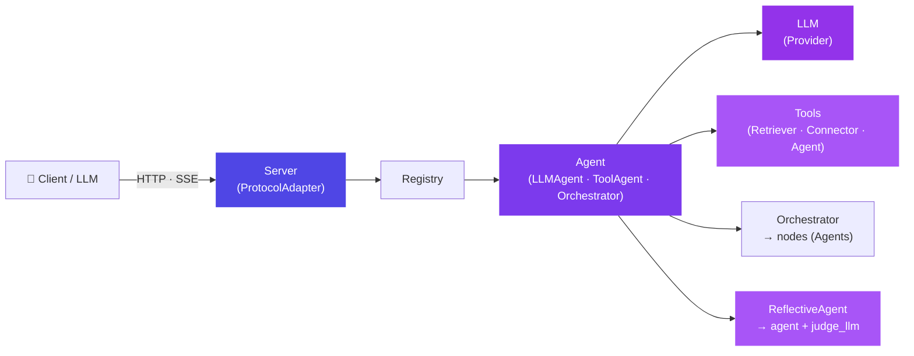

# aixon

> One framework. Declarative agents, multi-agent orchestration, and a protocol-decoupled server.

[](https://github.com/JorgeHSantana/aixon/actions/workflows/publish.yml)
[](https://codecov.io/gh/JorgeHSantana/aixon)
[](https://pypi.org/project/aixon/)
[](https://pypi.org/project/aixon/)
[](LICENSE)

`aixon` is a Python framework for building AI-agent systems. Subclass an agent type,
declare your LLM and tools as class attributes, and the agent self-registers — no
wiring, no routing table. Connect agents into multi-agent graphs with
`Orchestrator`. Serve them over any wire format through a pluggable
`ProtocolAdapter`. Run the whole thing locally or expose it as an API that any
OpenAI-compatible client can reach.

---

## Architecture



The **neutral boundary** is the key design principle: every agent speaks only
`Message[]` in and `Message`/`Chunk` out — no provider type, no wire type ever
crosses into the agent runtime. Protocol adapters translate on the outside;
provider SDKs stay hidden inside `LLM`.

---

## Installation

```bash
pip install aixon          # core: langchain + langgraph — agents work out of the box
```

`langchain`/`langchain-core`/`langgraph`/`click` are mandatory core dependencies
— the `aixon` command (`list`, `new`, in-process `chat`, and `serve` given the
`server` extra) is already on your PATH after a bare install. The optional
extras add the outer layers:

```bash
pip install "aixon[server]"            # FastAPI + uvicorn + httpx — serve agents as an API
pip install "aixon[cli]"               # openai — only needed for remote `aixon chat --url ...`
pip install "aixon[openai]"            # OpenAI provider binding (langchain-openai)
pip install "aixon[anthropic]"         # Anthropic provider binding
pip install "aixon[google]"            # Google provider binding
pip install "aixon[zai]"               # z.AI provider binding (GLM via langchain-openai)
pip install "aixon[retrieval]"         # httpx — Connector / HttpToolConnector
pip install "aixon[mcp]"               # mcp SDK — MCPConnector (MCP servers)
pip install "aixon[openai-embedding]"  # langchain-openai — OpenAIEmbedding
pip install "aixon[weaviate]"          # Weaviate vector-store Retriever
pip install "aixon[ragie]"             # Ragie managed-RAG Retriever
pip install "aixon[tavily]"            # Tavily web-search Retriever
pip install "aixon[rerank]"            # flashrank reranking (for Weaviate)
pip install "aixon[tiktoken]"          # token counting for the server `usage` field
pip install "aixon[all]"               # everything above
```

---

## 60-second quickstart

```bash
# 1. Scaffold a consumer project
aixon new my-agents
cd my-agents
pip install -e ".[all]"

# 2. Start the interactive chat
aixon chat

# 3. Or serve the OpenAI-compatible API
aixon serve
```

Or inline — no scaffolding needed:

```python
# agents/hello.py
from aixon import LLMAgent, LLM

class HelloAgent(LLMAgent):
    llm = LLM("gpt-4o-mini", temperature=0.2)
    description = "Greets the user"
    prompt = "You are a concise greeter. Reply in one sentence."
```

```python
# main.py
from aixon import autodiscover, Message
from aixon.registry import get_registry

autodiscover("agents")
agent = get_registry().resolve("helloagent")
reply = agent.invoke([Message(role="user", content="Hi!")])
print(reply.content)
```

```bash
python main.py
# → Hi there! How can I help you today?
```

---

## The Agent model

Everything in `aixon` is an `Agent` — a single callable unit with a uniform
interface:

```python
agent.invoke(messages: list[Message])  -> Message
agent.stream(messages: list[Message])  -> Iterator[Chunk]
agent.ainvoke(messages: list[Message]) -> Message            # async
agent.astream(messages: list[Message]) -> AsyncIterator[Chunk]
agent.as_tool(name=None, description=None) -> AgentTool
```

Sync is the default; `ainvoke`/`astream` are **additive** and run non-blocking
(native for `LLMAgent`/`ToolAgent`/`Orchestrator`, a thread-bridge for custom
sync agents). The server `await`s them, so concurrent requests don't serialize.

Four concrete subtypes cover the common cases. Pick the one that matches what
you need:

| Subtype | When to use | Suffix required |
|---|---|---|
| `LLMAgent` | Direct LLM call — no tools, no loop | `*Agent` |
| `ToolAgent` | LLM + tool-calling loop (LangGraph `create_agent`) | `*Agent` |
| `Orchestrator` | Multiple agents coordinated by a graph | `*Orchestrator` |
| `ReflectiveAgent` | Wrap a worker agent in a generate → judge → retry review loop | `*Agent` |

**Suffix rule:** every concrete subclass name must end with its declared suffix.
Violating it raises `NamingError` at import time — before the server starts.

```python
class Greeter(LLMAgent):    # ← raises NamingError: missing 'Agent' suffix
    ...

class GreeterAgent(LLMAgent):  # ← correct
    ...
```

---

## LLMAgent — direct LLM call

```python
from aixon import LLMAgent, LLM

class PlannerAgent(LLMAgent):
    llm         = LLM("gpt-4o-mini", temperature=0.2)
    description = "Strategic planner"
    prompt      = "You plan step-by-step actions for complex goals."
```

Attributes:

| Attribute | Type | Description |
|---|---|---|
| `llm` | `LLM` | **Required.** The language model to use. |
| `prompt` | `str` | Optional system prompt prepended to every conversation. |
| `description` | `str` | Human-readable purpose (shown in `aixon list`). |
| `name` | `str` | Registry name (defaults to lowercased class name). |
| `aliases` | `list[str]` | Alternate names for registry resolution. |
| `hidden` | `bool` | Exclude from `aixon chat` menu and `public()` listing. |

`LLM(model, reasoning=...)` turns on the provider's native reasoning/thinking
mode — `True` for medium effort, or `{"effort": "low"|"medium"|"high"}` /
`{"budget_tokens": int}` for finer control — translated per provider
(Anthropic `thinking` blocks, OpenAI `reasoning_effort`, z.AI/GLM
`extra_body.thinking`, Gemini `thinking_budget`). Note that OpenAI's API
returns no raw chain-of-thought (the knob only improves the answer) and GLM
reasoning text doesn't surface with the currently-installed `langchain-openai`
even though thinking is enabled server-side. See
[docs/agents.md](docs/agents.md#reasoning-extended-thinking--reasoning-effort)
for the full per-provider table and honesty notes.

`aixon list` output (no header, one agent per line):

```
greeteragent  [LLMAgent]  Friendly greeter
```

See [docs/agents.md](docs/agents.md) for `ToolAgent` and full API reference.

---

## Orchestrator — multi-agent graphs

```python
from aixon import Orchestrator, LLM

class SupportOrchestrator(Orchestrator):
    supervisor = LLM("gpt-4o-mini")          # routes each turn to a worker
    agents     = [BillingAgent, TechAgent, PlannerAgent]   # your own LLMAgent/ToolAgent classes
```

Three tiers — pick by complexity. See [docs/orchestrator.md](docs/orchestrator.md).

---

## ReflectiveAgent — evaluator-optimizer loop

```python
from aixon import ReflectiveAgent, LLM

class ReviewedWriterAgent(ReflectiveAgent):
    agent         = WriterAgent                  # worker: any Agent, class or instance
    judge_llm     = LLM("gpt-4o-mini", temperature=0)
    judge_rubric  = "The answer must cite a source for every fact it states."
    max_rounds    = 3
```

Generate → judge against an objective rubric → on rejection, retry with the
critique — up to `max_rounds`. Exhausting the rounds returns the last attempt
rather than raising. See [docs/agents.md](docs/agents.md#reflectiveagent--evaluator-optimizer-loop)
and the runnable [examples/reflective_review](examples/reflective_review).

**Cost/latency per round.** Retries only append messages (byte-stable prefix),
so OpenAI prompt caching applies automatically; for Anthropic, opt in with
`LLM(..., cache=True)` (cache_control breakpoints, incremental per round).
Tool calls repeated with identical args across rounds are memoized for the run
(`aixon.toolcache`; opt out per tool with `as_tool(memoize=False)`). OpenAI
workers receive the previous attempt as a Predicted Output on retries (latency
win). `revision_mode = "patch"` (opt-in) asks retries for SEARCH/REPLACE edit
blocks instead of a full rewrite — output-cost saver for long answers, with
automatic fallback to full regeneration when a patch doesn't apply. Tool
exceptions never kill a run: they come back to the model as readable
`TOOL ERROR` results (strict mode: `shield_tool_errors = False` on the agent).

---

## Retrieval — Retriever, Connector, Embedding

`Retriever` is the base class for any agent that fetches context. Name it with a
`*Retriever` suffix and declare `type_access` to control read/write permissions
(`TypeAccess.READ`, `TypeAccess.WRITE`, or `TypeAccess.ALL`).

```python
from aixon import Retriever, TypeAccess

class LibraryRetriever(Retriever):
    description = "Fetches relevant documents from the knowledge base"
    type_access = TypeAccess.READ
```

Every `Retriever` has a sync `search` and a native async `asearch`; `as_tool()`
returns a dual tool that works on both the sync and async agent paths.

`Connector` is an HTTP base class for wrapping external APIs (`base_url_env` /
`auth_token_env`, sync `get`/`post` and async `aget`/`apost`). `HttpToolConnector`
builds on it for HTTP-JSON tool servers where each typed method is a curated
tool. `MCPConnector` (extra `aixon[mcp]`) covers the opposite case: point it at
an [MCP](https://modelcontextprotocol.io) server and `toolset()` turns the
server's published catalog into `AgentTool`s — the LLM drives the published
JSON Schemas, no wrapper per tool. `toolset()` is a deferred marker (no I/O at
construction); discovery runs lazily at the agent's first invoke, so a bad
server can't block boot:

```python
class MetabaseMCPConnector(MCPConnector):
    base_url_env   = "MCP_METABASE_URL"
    auth_token_env = "MCP_METABASE_TOKEN"

class AnalystAgent(ToolAgent):
    llm   = LLM("gpt-4o-mini")
    tools = [MetabaseMCPConnector().toolset(exclude=["delete_card"])]
```

(`as_tools()`/`aas_tools()` stay available, eager, for runtime/script code —
see [docs/retrieval.md](docs/retrieval.md#mcpconnector--mcp-servers).)

`Embedding` is the vector-embedding ABC; the built-in implementation is
`OpenAIEmbedding`.

**Vendor retrievers** ship behind optional extras — each a neutral `Retriever`,
lazy (the vendor SDK is imported only on use) and async-native:

| Retriever | Extra | Backend |
|---|---|---|
| `WeaviateRetriever` | `aixon[weaviate]` | Weaviate vector store (+ `aixon[rerank]` for flashrank) |
| `RagieRetriever` | `aixon[ragie]` | Ragie managed RAG |
| `TavilyRetriever` | `aixon[tavily]` | Tavily web search |

```python
from aixon import Retriever, TypeAccess, Connector, Embedding, OpenAIEmbedding
```

See [docs/retrieval.md](docs/retrieval.md) (ABCs) and
[docs/retrievers.md](docs/retrievers.md) (vendor backends).

---

## Server

```python
from aixon import Server, autodiscover

autodiscover("agents")
server = Server()
server.serve(host="0.0.0.0", port=8000)
```

Any OpenAI-compatible client works out of the box:

```python
from openai import OpenAI
client = OpenAI(base_url="http://localhost:8000/v1", api_key="test")
response = client.chat.completions.create(
    model="planneragent",
    messages=[{"role": "user", "content": "Plan a trip to Tokyo."}],
)
```

See [docs/server.md](docs/server.md) for Anthropic adapter, auth, and SSE streaming.

---

## Environment variables

| Variable | Default | Description |
|---|---|---|
| `LOG_LEVEL` | `INFO` | Framework log level: `DEBUG`, `INFO`, `WARNING`, `ERROR`. |
| `AUTH_API_KEY` | _(disabled)_ | Bearer token for the server. Unset = no auth. Multiple keys comma-separated. |
| `OPENAI_API_KEY` | _(required for OpenAI)_ | API key for the OpenAI provider. |
| `ANTHROPIC_API_KEY` | _(required for Anthropic)_ | API key for the Anthropic provider. |
| `GOOGLE_API_KEY` | _(required for Google)_ | API key for the Google provider. |
| `ZAI_API_KEY` | _(required for z.AI)_ | API key for the z.AI provider (GLM models). `ZAI_BASE_URL` overrides the default `https://api.z.ai/api/paas/v4`. |

---

## Naming conventions

Suffix violations raise `NamingError` at import time — the server never starts
with a mis-named class.

| Base class | Required suffix | Example |
|---|---|---|
| `LLMAgent` | `*Agent` | `PlannerAgent` |
| `ToolAgent` | `*Agent` | `DiagnosisAgent` |
| `Orchestrator` | `*Orchestrator` | `SupportOrchestrator` |
| `ReflectiveAgent` | `*Agent` | `ReviewedWriterAgent` |
| `Retriever` | `*Retriever` | `LibraryRetriever` |
| `Connector` | `*Connector` | `CRMConnector` |
| `MCPConnector` | `*Connector` | `MetabaseMCPConnector` |

Abstract intermediate classes (declared with `abstract=True`) are exempt and
never registered.

---

## Documentation

- [Architecture](docs/architecture.md) — layers, neutral boundary, protocol decoupling
- [Agents](docs/agents.md) — `LLMAgent`, `ToolAgent`, `ReflectiveAgent`, declarative API, `as_tool`, async
- [Orchestrator](docs/orchestrator.md) — three tiers, entry/topology, branching, recursion guards
- [Server](docs/server.md) — `ProtocolAdapter`, adapters, auth, SSE
- [Tracing](docs/tracing.md) — observability with LangSmith / Langfuse (self-hosted) / console: zero framework changes
- [Retrieval](docs/retrieval.md) — `Retriever`, `Embedding`, `Connector`, `MCPConnector`
- [Vendor retrievers](docs/retrievers.md) — `Weaviate`, `Ragie`, `Tavily`
- [CLI](docs/cli.md) — `chat`, `new`, `serve`, `list`
- [Quickstart](docs/quickstart.md) — consumer project walkthrough
- [Example](examples/support_assistant) — a complete multi-agent support assistant, runnable offline
- [Example: Reflective Review](examples/reflective_review) — the `ReflectiveAgent` loop, runnable offline
- [Example: Tracing](examples/tracing) — the execution tree a tracer captures, runnable offline

---

## Development

```bash
pip install -e ".[all,dev]"   # every extra + the test suite (pytest, mypy, ...)
pytest                         # run the suite
mypy aixon                     # type-check the package
```

CI runs both `mypy aixon` and the full suite on every push/PR. Both the PR
gate and the push-to-main publish pipeline additionally run a bare-install
smoke job (`pip install .` with no extras, then `import aixon` and
`aixon --help`) that guards the neutral-boundary/lazy-import discipline — the
core package must stay importable and the CLI runnable without any optional
dependency installed.

---

## Dependencies

```
langchain             >= 1.0    (core)
langchain-core        >= 1.0    (core)
langgraph             >= 1.0    (core)
click                 >= 8.0    (core — the `aixon` command)
fastapi / uvicorn / pydantic    (server extra)
httpx                 >= 0.27   (server / retrieval extra)
openai                >= 1.0    (cli extra — remote `aixon chat --url`)
langchain-openai      >= 0.2    (openai / openai-embedding / zai extra)
langchain-anthropic   >= 0.2    (anthropic extra)
langchain-google-genai >= 2.0   (google extra)
weaviate-client / langchain-weaviate  (weaviate extra)
ragie                 >= 2      (ragie extra)
tavily-python         >= 0.7    (tavily extra)
flashrank             >= 0.2    (rerank extra)
tiktoken              >= 0.7    (tiktoken extra)
```

---

## Author

**Jorge Henrique Moreira Santana**  
Electrical Engineer, Postgraduate in Artificial Intelligence  
[LinkedIn](https://www.linkedin.com/in/jorge-santana-b246874a/) · ti@zeusagro.com

---

## License

[MIT](LICENSE)
