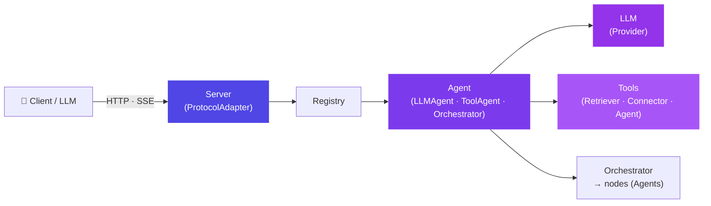

# aixon Documentation Implementation Plan

> **For agentic workers:** REQUIRED SUB-SKILL: Use superpowers:subagent-driven-development (recommended) or superpowers:executing-plans to implement this plan task-by-task. Steps use checkbox (`- [ ]`) syntax for tracking.

**Goal:** Write full framework documentation — `README.md` + `docs/` — at restmcp depth: overview, install, quickstart, the Agent model and three subtypes, declarative API, suffix rules, the three Orchestrator tiers (entry/topology mechanics, two branching kinds), protocol decoupling, Retriever/Connector/LLM/Embedding, CLI, and a consumer-project walkthrough.

**Architecture:** Each doc file covers exactly one concern; README links to them. Every prose snippet is drawn from the interface contract (`docs/superpowers/aixon-interface-contract.md`) — no invented signatures. The existing `README.md` (a one-line stub from Plan 1) is replaced entirely. No production code is written; doc examples are illustrative only. Consistency verification is done via grep against `aixon/__init__.py` exports and a final cross-link audit.

**Tech Stack:** Markdown, Python doctest (where `>>>`-form examples exist), grep-based consistency checks.

## Global Constraints

- Docs must match restmcp README depth and structure: every public class/method surfaces in a code block with real signatures.
- Every documented signature must match the interface contract (`aixon-interface-contract.md`) verbatim — do NOT invent or simplify signatures.
- Code snippets in every file must be self-consistent (imports resolve, names match the contract) and runnable by a reader with the package installed.
- This is a docs plan — no production code beyond illustrative doc examples. Modifications to `aixon/` source are not in scope.
- The existing `README.md` is a one-line stub from Plan 1; this plan replaces it entirely.
- Python 3.11+ and `hatchling` build backend — match the pyproject.toml already in the repo.
- Error messages follow the contract's tone: state what was received and how to fix it.

---

### File Map

| File | Responsibility |
|---|---|
| `README.md` | Overview, install, 60-second quickstart, agent model + subtypes overview, env-var table, links to `docs/` |
| `docs/architecture.md` | Layer diagram, neutral boundary, protocol decoupling narrative |
| `docs/agents.md` | `LLMAgent`/`ToolAgent` declarative API, suffix rules, `as_tool`, `AgentTool` |
| `docs/orchestrator.md` | All three tiers, entry/topology mechanics, two branching kinds, recursion guards, `GraphState` |
| `docs/server.md` | `ProtocolAdapter`, `OpenAIAdapter`/`AnthropicAdapter`, `Server`, auth, SSE streaming |
| `docs/retrieval.md` | `Retriever`/`TypeAccess`, `Embedding`/`OpenAIEmbedding`, `Connector` |
| `docs/cli.md` | `aixon chat/new/serve/list`, in-process vs remote, `Ctrl+C`/`/menu`/`/exit` |
| `docs/quickstart.md` | Build a consumer project end-to-end (scaffold → agent → serve → chat) |

---

### Task 1: README.md — overview, install, quickstart, agent model, env vars, links

**Files:**
- Modify: `README.md` (full replacement of the one-line stub)

**Interfaces:**
- Produces: the project's front door. Every class name that appears here is linked to the relevant `docs/` page.
- Consumes (contract sections to document): §0 (`Agent`, `Message`, `Chunk`, `AgentTool`, `autodiscover`, registry), §1 (`LLM`, `LLMAgent`), §2 (`ToolAgent`), §3 (`Orchestrator`), §4 (`Server`), §5 (`Retriever`, `Connector`, `Embedding`), §6 (`aixon chat|new|serve|list`).

- [ ] **Step 1: Write the complete README.md**

```markdown
# aixon

> One framework. Declarative agents, multi-agent orchestration, and a protocol-decoupled server.

`aixon` is a Python framework for building AI-agent systems. Subclass an agent type,
declare your LLM and tools as class attributes, and the agent self-registers — no
wiring, no routing table. Connect agents into multi-agent graphs with
`Orchestrator`. Serve them over any wire format through a pluggable
`ProtocolAdapter`. Run the whole thing locally or expose it as an API that any
OpenAI-compatible client can reach.

---

## Architecture



The **neutral boundary** is the key design principle: every agent speaks only
`Message[]` in and `Message`/`Chunk` out — no provider type, no wire type ever
crosses into the agent runtime. Protocol adapters translate on the outside;
provider SDKs stay hidden inside `LLM`.

---

## Installation

```bash
pip install aixon
```

Optional extras:

```bash
pip install "aixon[llm]"          # LangChain core + LangGraph (required for agents)
pip install "aixon[openai]"       # OpenAI provider SDK
pip install "aixon[anthropic]"    # Anthropic provider SDK
pip install "aixon[google]"       # Google provider SDK
pip install "aixon[server]"       # FastAPI + uvicorn + httpx
pip install "aixon[cli]"          # click + openai (remote chat mode)
pip install "aixon[retrieval]"    # httpx (Connector HTTP client)
pip install "aixon[all]"          # everything above
```

---

## 60-second quickstart

```bash
# 1. Scaffold a consumer project
aixon new my-agents
cd my-agents
pip install -e ".[all]"

# 2. Start the interactive chat
aixon chat

# 3. Or serve the OpenAI-compatible API
aixon serve
```

Or inline — no scaffolding needed:

```python
# agents/hello.py
from aixon import LLMAgent, LLM

class HelloAgent(LLMAgent):
    llm = LLM("gpt-5.4", temperature=0.2)
    description = "Greets the user"
    prompt = "You are a concise greeter. Reply in one sentence."
```

```python
# main.py
from aixon import autodiscover
from aixon.registry import get_registry

autodiscover("agents")
agent = get_registry().resolve("helloagent")
reply = agent.invoke([{"role": "user", "content": "Hi!"}])
print(reply.content)
```

```bash
python main.py
# → Hi there! How can I help you today?
```

---

## The Agent model

Everything in `aixon` is an `Agent` — a single callable unit with a uniform
interface:

```python
agent.invoke(messages: list[Message]) -> Message
agent.stream(messages: list[Message]) -> Iterator[Chunk]
agent.as_tool(name=None, description=None) -> AgentTool
```

Three concrete subtypes cover the common cases. Pick the one that matches what
you need:

| Subtype | When to use | Suffix required |
|---|---|---|
| `LLMAgent` | Direct LLM call — no tools, no loop | `*Agent` |
| `ToolAgent` | LLM + tool-calling loop (`AgentExecutor`) | `*Agent` |
| `Orchestrator` | Multiple agents coordinated by a graph | `*Orchestrator` |

**Suffix rule:** every concrete subclass name must end with its declared suffix.
Violating it raises `NamingError` at import time — before the server starts.

```python
class Greeter(LLMAgent):    # ← raises NamingError: missing 'Agent' suffix
    ...

class GreeterAgent(LLMAgent):  # ← correct
    ...
```

---

## LLMAgent — direct LLM call

```python
from aixon import LLMAgent, LLM

class PlannerAgent(LLMAgent):
    llm         = LLM("gpt-5.4", temperature=0.2)
    description = "Strategic planner"
    prompt      = "You plan step-by-step actions for complex goals."
```

Attributes:

| Attribute | Type | Description |
|---|---|---|
| `llm` | `LLM` | **Required.** The language model to use. |
| `prompt` | `str` | Optional system prompt prepended to every conversation. |
| `description` | `str` | Human-readable purpose (shown in `aixon list`). |
| `name` | `str` | Registry name (defaults to lowercased class name). |
| `aliases` | `list[str]` | Alternate names for registry resolution. |
| `hidden` | `bool` | Exclude from `aixon chat` menu and `public()` listing. |

See [docs/agents.md](docs/agents.md) for `ToolAgent` and full API reference.

---

## Orchestrator — multi-agent graphs

```python
from aixon import Orchestrator, LLM
from aixon.state import END

class SupportOrchestrator(Orchestrator):
    supervisor = LLM("gpt-5.4")
    agents     = [BillingAgent, TechAgent, PlannerAgent]
```

Three tiers — pick by complexity. See [docs/orchestrator.md](docs/orchestrator.md).

---

## Server

```python
from aixon import Server, autodiscover

autodiscover("agents")
server = Server()
server.serve(host="0.0.0.0", port=8000)
```

Any OpenAI-compatible client works out of the box:

```python
from openai import OpenAI
client = OpenAI(base_url="http://localhost:8000/v1", api_key="test")
response = client.chat.completions.create(
    model="planneragent",
    messages=[{"role": "user", "content": "Plan a trip to Tokyo."}],
)
```

See [docs/server.md](docs/server.md) for Anthropic adapter, auth, and SSE streaming.

---

## Environment variables

| Variable | Default | Description |
|---|---|---|
| `LOG_LEVEL` | `INFO` | Framework log level: `DEBUG`, `INFO`, `WARNING`, `ERROR`. |
| `AUTH_API_KEY` | _(disabled)_ | Bearer token for the server. Unset = no auth. Multiple keys comma-separated. |
| `OPENAI_API_KEY` | _(required for OpenAI)_ | API key for the OpenAI provider. |
| `ANTHROPIC_API_KEY` | _(required for Anthropic)_ | API key for the Anthropic provider. |
| `GOOGLE_API_KEY` | _(required for Google)_ | API key for the Google provider. |

---

## Naming conventions

Suffix violations raise `NamingError` at import time — the server never starts
with a mis-named class.

| Base class | Required suffix | Example |
|---|---|---|
| `LLMAgent` | `*Agent` | `PlannerAgent` |
| `ToolAgent` | `*Agent` | `DiagnosisAgent` |
| `Orchestrator` | `*Orchestrator` | `SupportOrchestrator` |
| `Retriever` | `*Retriever` | `LibraryRetriever` |
| `Connector` | `*Connector` | `CRMConnector` |

Abstract intermediate classes (declared with `abstract=True`) are exempt and
never registered.

---

## Documentation

- [Architecture](docs/architecture.md) — layers, neutral boundary, protocol decoupling
- [Agents](docs/agents.md) — `LLMAgent`, `ToolAgent`, declarative API, `as_tool`
- [Orchestrator](docs/orchestrator.md) — three tiers, entry/topology, branching, recursion guards
- [Server](docs/server.md) — `ProtocolAdapter`, adapters, auth, SSE
- [Retrieval](docs/retrieval.md) — `Retriever`, `Embedding`, `Connector`
- [CLI](docs/cli.md) — `chat`, `new`, `serve`, `list`
- [Quickstart](docs/quickstart.md) — consumer project walkthrough

---

## Dependencies

```
langchain      >= 0.3
langchain-core >= 0.3
langgraph      >= 0.2
fastapi        >= 0.100   (server extra)
uvicorn        >= 0.20    (server extra)
pydantic       >= 2.0
click          >= 8.0
httpx          >= 0.27    (retrieval extra)
```

---

## Author

**Jorge Henrique Moreira Santana**  
Electrical Engineer, Postgraduate in Artificial Intelligence  
[LinkedIn](https://www.linkedin.com/in/jorge-santana-b246874a/) · ti@zeusagro.com

---

## License

[MIT](LICENSE)
```

- [ ] **Step 2: Consistency check**

Grep every class name that appears in the README against the contract:

```bash
# Each of these should appear in aixon-interface-contract.md
grep -n "LLMAgent\|ToolAgent\|Orchestrator\|Retriever\|Connector\|Server\|ProtocolAdapter\|AgentTool\|LLM\b" \
  /Users/jorge/Documents/Git/aixon/docs/superpowers/aixon-interface-contract.md
```

Expected: all names resolve. Confirm the env-var table lists exactly `LOG_LEVEL`, `AUTH_API_KEY`, `OPENAI_API_KEY`, `ANTHROPIC_API_KEY`, `GOOGLE_API_KEY` — match the contract's §1.2, §4.3, §0 (logging).

- [ ] **Step 3: Commit**

```bash
git add README.md
git commit -m "docs: replace README stub with full overview, quickstart, and env-var table"
```

---

### Task 2: docs/architecture.md — layers, neutral boundary, protocol decoupling

**Files:**
- Create: `docs/architecture.md`

**Interfaces:**
- Consumes (contract): §0 (`Message`, `Chunk`, neutral boundary convention), §1.4 (`_langchain.py` boundary note), §4 (`ProtocolAdapter` decoupling), design spec §"Desacoplamento de protocolo", §"Fluxo de um request".
- Produces: the architectural narrative that all other docs reference.

- [ ] **Step 1: Write docs/architecture.md**

```markdown
# Architecture

## Layers

```
HTTP / SSE
    │
ProtocolAdapter          ← translates wire ↔ neutral types (Message[], Chunk)
    │
Server (Registry)        ← resolves agent name from request's "model" field
    │
Agent.invoke / stream    ← speaks ONLY neutral types; no wire type crosses here
    │
    ├── LLMAgent  → LLM → Provider → vendor SDK (OpenAI / Anthropic / Google)
    ├── ToolAgent → AgentExecutor → tools: Retriever · Connector · Agent.as_tool()
    └── Orchestrator → LangGraph → nodes (Agents) → ...
```

Each layer depends only on the layer directly below it. Provider SDKs, LangChain
internals, and wire-format objects are contained within their layer and never
cross upward.

---

## The neutral boundary

`Agent.invoke` and `Agent.stream` speak two neutral types only:

```python
# aixon/message.py — the only types that cross the boundary

from dataclasses import dataclass, field
from typing import Any, Literal, Optional

Role = Literal["system", "user", "assistant", "tool"]

@dataclass
class Message:
    role: Role
    content: str = ""
    name: Optional[str] = None
    tool_calls: list[dict[str, Any]] = field(default_factory=list)
    tool_call_id: Optional[str] = None
    reasoning: Optional[str] = None

    def to_dict(self) -> dict[str, Any]: ...   # omits empty optional fields

@dataclass
class Chunk:
    content: str = ""
    reasoning: str = ""
    done: bool = False
```

`Message` carries a conversation turn. `Chunk` is a streaming delta — `content`
and `reasoning` are additive text; the final `Chunk` has `done=True`.

**What the neutral boundary prevents:** a `ToolAgent` can swap its LLM from
OpenAI to Anthropic without touching the `Orchestrator` that calls it as a node.
The `Server` can mount a new `ProtocolAdapter` without touching any `Agent`.
Provider types (`langchain_openai.ChatOpenAI`) stay inside `LLM` and never reach
an agent's `invoke` signature.

---

## Protocol decoupling

`ProtocolAdapter` is the seam between wire formats and the neutral runtime. The
server mounts one or more adapters; each handles its own routes:

```
OpenAI client  ──→  OpenAIAdapter.parse_request  ──→  Message[]
                                                         ↓
                                                    agent.invoke
                                                         ↓
                ←── OpenAIAdapter.format_response  ←── Message

Anthropic SDK  ──→  AnthropicAdapter.parse_request ──→  Message[]
                                                         ↓
                                                    agent.invoke
                                                         ↓
                ←── AnthropicAdapter.format_response ←── Message
```

Adding a new wire format = adding a new `ProtocolAdapter` subclass. Nothing in
`Agent`, `LLM`, or `Registry` changes.

`aixon` ships two adapters:
- **`OpenAIAdapter`** — full OpenAI-compatible (`/v1/chat/completions`, `/v1/models`).
- **`AnthropicAdapter`** — thin proof-of-concept (`/v1/messages`). Demonstrates that
  the neutral types are not secretly OpenAI types — Anthropic's structurally
  different wire format (typed content blocks, `stop_reason`, named SSE events)
  translates through the same `Message`/`Chunk` boundary.

See [server.md](server.md) for the adapter API.

---

## Request flow (end to end)

```
HTTP POST /v1/chat/completions
  body: {"model": "planneragent", "messages": [...], "stream": true}
  │
  ▼
ProtocolAdapter.parse_request(body)
  → ParsedRequest(model="planneragent", messages=[Message(...)], stream=True)
  │
  ▼
get_registry().resolve("planneragent")
  → PlannerAgent instance
  │
  ▼
agent.stream(messages)
  → Iterator[Chunk(content="..."), ..., Chunk(done=True)]
  │
  ▼
ProtocolAdapter.format_stream_chunk / format_stream_done
  → SSE: data: {"choices": [{"delta": {"content": "..."}}]}
  │
  ▼
HTTP response (streaming)
```

---

## Auto-registration

Agents self-register at class definition time. `autodiscover(package)` imports
every non-underscore module in a package, which triggers each class body —
and therefore each registration — without any explicit list to maintain.

```python
from aixon import autodiscover
from aixon.registry import get_registry

autodiscover("agents")           # imports agents/hello.py, agents/support.py, …
agent = get_registry().resolve("helloagent")
```

The registry is a process-global singleton. The `autouse` pytest fixture in
`tests/conftest.py` calls `reset_registry()` between tests so they stay
isolated.

---

## Suffix enforcement

Every concrete subclass of a base type must end with the declared `_suffix`.
The check runs in `Agent.__init_subclass__` — before the class is instantiated,
before the server starts.

```python
class Greeter(LLMAgent):      # ← NamingError raised here, at import time
    llm = LLM("gpt-5.4")

class GreeterAgent(LLMAgent): # ← fine
    llm = LLM("gpt-5.4")
```

Abstract intermediate classes opt out with `abstract=True` and are never
registered:

```python
class BaseResearchAgent(LLMAgent, abstract=True):
    prompt = "You are a research assistant."
    # no llm declared — subclasses must supply it

class WebResearchAgent(BaseResearchAgent):
    llm = LLM("gpt-5.4")   # ← registered as "webresearchagent"
```
```

- [ ] **Step 2: Consistency check**

```bash
grep -n "ParsedRequest\|ProtocolAdapter\|OpenAIAdapter\|AnthropicAdapter" \
  /Users/jorge/Documents/Git/aixon/docs/superpowers/aixon-interface-contract.md | head -20
```

Confirm `ParsedRequest` fields (`model`, `messages`, `params`, `stream`) match §4.1 of the contract exactly. Confirm the request-flow example uses `PlannerAgent` (consistent with Task 1's README quickstart).

- [ ] **Step 3: Commit**

```bash
git add docs/architecture.md
git commit -m "docs: architecture — layers, neutral boundary, protocol decoupling, request flow"
```

---

### Task 3: docs/agents.md — LLMAgent, ToolAgent, declarative API, suffix rules, as_tool

**Files:**
- Create: `docs/agents.md`

**Interfaces:**
- Consumes (contract): §0 (`Agent`, `AgentTool`, `aliases`, `hidden`, `owned_by`), §1 (`LLM`, `LLMAgent`, `prompt`), §2 (`ToolAgent`, `tools`, `max_iterations`, `max_execution_time`, `ReasoningChannel`, `coerce_tools`).

- [ ] **Step 1: Write docs/agents.md**

```markdown
# Agents

An **`Agent`** is the single executable unit in `aixon`. Every agent — regardless
of subtype — exposes the same interface:

```python
agent.invoke(messages: list[Message]) -> Message
agent.stream(messages: list[Message]) -> Iterator[Chunk]
agent.as_tool(name=None, description=None) -> AgentTool
```

This uniformity means a `ToolAgent` can be a node in an `Orchestrator`, an
`Orchestrator` can be a tool inside a `ToolAgent`, and the `Server` never needs
to know which subtype it is calling.

---

## Declaring an agent

Subclass one of the three concrete types and set class attributes. The agent
self-registers when Python processes the class body — no call to a registration
function required.

### Common attributes (all subtypes)

| Attribute | Type | Default | Description |
|---|---|---|---|
| `name` | `str` | class name lowercased | Registry key and API `model` field. |
| `description` | `str` | `""` | Human-readable purpose; shown in `aixon list` and the chat menu. |
| `aliases` | `list[str]` | `[]` | Alternate registry names. |
| `hidden` | `bool` | `False` | Exclude from `get_registry().public()` and the `aixon chat` menu. |
| `owned_by` | `str` | `"aixon"` | Shown in `/v1/models` response. |

---

## LLMAgent — direct LLM call

Use `LLMAgent` when you want a single LLM call with no tool loop — the simplest
path from question to answer.

```python
from aixon import LLMAgent, LLM

class PlannerAgent(LLMAgent):
    llm         = LLM("gpt-5.4", temperature=0.2)
    description = "Breaks complex goals into step-by-step plans"
    prompt      = "You are a concise strategic planner. Use numbered lists."
```

**Additional `LLMAgent` attributes:**

| Attribute | Type | Required | Description |
|---|---|---|---|
| `llm` | `LLM` | **Yes** | The language model. Missing `llm` on a concrete subclass raises `AixonError` at import time. |
| `prompt` | `str` | No | System prompt prepended to every `invoke`/`stream` call. |

**How it works:** `invoke` prepends the system prompt (if any) as a
`Message(role="system", content=self.prompt)` and delegates to
`self.llm.complete(messages)`. `stream` delegates to `self.llm.stream(messages)`,
yielding `Chunk` deltas and a final `Chunk(done=True)`.

### LLM — declaring a language model

```python
from aixon import LLM

# Explicit provider
llm = LLM("claude-opus-4", provider="anthropic", temperature=0.3)

# Inferred provider (model prefix → provider):
#   gpt-* / o[0-9]* / text-*  →  openai
#   claude-*                   →  anthropic
#   gemini-*                   →  google
llm = LLM("gpt-5.4", temperature=0.2, max_tokens=4096)
```

The `LLM` object is lazy — it builds the underlying LangChain `BaseChatModel`
only on first use, so constructing an agent never requires a network call or an
API key to be present at import time.

---

## ToolAgent — LLM + tool-calling loop

Use `ToolAgent` when your agent needs to call external functions, query a
`Retriever`, or invoke another agent as a tool, then loop until it has a final
answer.

```python
from aixon import ToolAgent, LLM
from langchain_community.tools import DuckDuckGoSearchRun

from retrievers.library import LibraryRetriever

class ResearchAgent(ToolAgent):
    llm                 = LLM("gpt-5.4", temperature=0.1)
    description         = "Researches topics using web search and the knowledge base"
    prompt              = "Always cite your sources. Think step by step."
    tools               = [LibraryRetriever, DuckDuckGoSearchRun()]
    max_iterations      = 15
    max_execution_time  = 600
```

**Additional `ToolAgent` attributes:**

| Attribute | Type | Default | Description |
|---|---|---|---|
| `llm` | `LLM` | **Required** | The language model driving the loop. |
| `prompt` | `str` | `""` | System prompt. |
| `tools` | `list` | `[]` | Mix of `AgentTool`, `Retriever`, LangChain `@tool` functions, or any callable. All are coerced to `BaseTool` internally via `coerce_tools`. |
| `max_iterations` | `int` | `15` | Maximum tool-call rounds before the loop stops. |
| `max_execution_time` | `int` | `600` | Wall-clock timeout in seconds. |

**Tool coercion:** anything in `tools` is normalized at runtime:
- An `AgentTool` (from `Agent.as_tool()` or `Retriever.as_tool()`) → `StructuredTool`
- A LangChain `BaseTool` or `@tool`-decorated function → passed through
- A plain callable → wrapped via `StructuredTool.from_function`

This means you can mix library tools, custom functions, and other agents freely.

### Nesting agents as tools

Any `Agent` exposes itself as a tool via `as_tool()`. The result is a neutral
`AgentTool` — coerced to a LangChain tool inside `ToolAgent` automatically.

```python
from aixon import ToolAgent, LLM

class OrchestratorAgent(ToolAgent):
    llm   = LLM("gpt-5.4")
    tools = [
        PlannerAgent().as_tool(description="Break the goal into steps"),
        ResearchAgent().as_tool(),
    ]
```

**Reasoning propagation:** when a nested agent emits reasoning (via the
`ReasoningChannel`), that reasoning bubbles up through the outer `stream()` as
`Chunk(reasoning=...)` deltas — so callers see the full chain of thought even
across nesting levels.

---

## Agent.as_tool — the neutral tool descriptor

```python
@dataclass
class AgentTool:
    name: str
    description: str
    func: Callable[[str], str]
```

```python
tool = agent.as_tool()
tool = agent.as_tool(name="planner", description="Decomposes goals")
```

`func` wraps `agent.invoke`: each call creates a fresh `[Message(role="user",
content=text)]` — the agent's state never leaks between tool calls. The same
`AgentTool` shape is returned by `Retriever.as_tool()`, so `ToolAgent.tools`
handles both uniformly.

---

## Suffix rule reference

| Base class | `_suffix` | Valid example | Invalid (raises `NamingError`) |
|---|---|---|---|
| `LLMAgent` | `"Agent"` | `PlannerAgent` | `Planner`, `PlannerLLM` |
| `ToolAgent` | `"Agent"` | `ResearchAgent` | `Research`, `ResearchTool` |
| `Orchestrator` | `"Orchestrator"` | `SupportOrchestrator` | `Support`, `SupportAgent` |

**Abstract subtypes** (your own base classes) bypass the suffix check by passing
`abstract=True`. Their concrete subclasses are then validated:

```python
class BaseSupportAgent(ToolAgent, abstract=True):
    llm   = LLM("gpt-5.4")
    tools = [check_ticket]

class BillingAgent(BaseSupportAgent):     # ← valid: ends with "Agent"
    prompt = "You handle billing issues."

class TechAgent(BaseSupportAgent):        # ← valid
    prompt = "You handle technical issues."
```
```

- [ ] **Step 2: Consistency check**

```bash
# Verify LLMAgent/ToolAgent attribute names against contract §1.5 and §2.2
grep -A 10 "class LLMAgent" \
  /Users/jorge/Documents/Git/aixon/docs/superpowers/aixon-interface-contract.md
grep -A 15 "class ToolAgent" \
  /Users/jorge/Documents/Git/aixon/docs/superpowers/aixon-interface-contract.md
```

Confirm: `llm`, `prompt`, `tools`, `max_iterations`, `max_execution_time` match contract §2.2 exactly. Confirm `AgentTool` fields (`name`, `description`, `func`) match §0.

- [ ] **Step 3: Commit**

```bash
git add docs/agents.md
git commit -m "docs: agents — LLMAgent, ToolAgent, declarative API, as_tool, suffix rules"
```

---

### Task 4: docs/orchestrator.md — three tiers, entry/topology, branching kinds, recursion guards

This is the most subtle document in the set. The Orchestrator has three tiers,
the Tier 2 graph has non-obvious execution mechanics, and there are two distinct
kinds of branching — all must be explained clearly and correctly.

**Files:**
- Create: `docs/orchestrator.md`

**Interfaces:**
- Consumes (contract): §3 in full — `Orchestrator`, `GraphState`, `END`, tier detection order, Tier 1 supervisor pattern, Tier 2 `entry`/`edges`/`route_<node>` mechanics, fan-out vs conditional branching, Tier 3 escape hatch, recursion guards A (composition cycle) and B (runtime depth), `CompositionCycleError`.

- [ ] **Step 1: Write docs/orchestrator.md**

```markdown
# Orchestrator

`Orchestrator` is the `Agent` subtype for coordinating multiple agents.
Like all agents, it exposes `invoke`, `stream`, and `as_tool` — so an orchestrator
can be a node inside another orchestrator, a tool inside a `ToolAgent`, or the
top-level entry point served by the `Server`.

Three tiers handle different levels of complexity. Pick the lowest tier that
covers your case — you can always promote to a higher tier later.

```python
from aixon import Orchestrator, LLM
from aixon.state import END, GraphState
```

---

## Tier 1 — Supervisor (default)

The supervisor pattern is the simplest: an LLM decides which worker agent handles
each turn and loops until it decides the conversation is complete.

```python
class SupportOrchestrator(Orchestrator):
    description = "Routes support tickets to the right specialist"
    supervisor  = LLM("gpt-5.4")
    agents      = [BillingAgent, TechAgent, PlannerAgent]
```

**How it works:** the supervisor LLM receives the conversation history and the
list of available workers (names + descriptions). It selects the next worker,
routes the turn, receives the result, and decides whether to call another worker
or return the final answer.

**When to use:** the routing logic is best expressed in natural language — "send
billing questions to BillingAgent, technical questions to TechAgent."

---

## Tier 2 — Explicit graph

Use Tier 2 when the routing is deterministic (or conditionally deterministic) and
you want it expressed in code rather than natural language.

```python
class TriageOrchestrator(Orchestrator):
    description = "Triages issues with conditional routing"

    nodes = {
        "triage":   TriageAgent,
        "diagnose": DiagnosisAgent,
        "respond":  PlannerAgent,
    }
    entry = "triage"
    edges = [
        ("diagnose", "respond"),
        ("respond",  END),
    ]

    def route_triage(self, state) -> str:
        return "diagnose" if state["needs_diagnosis"] else "respond"
```

### Entry and execution order

**`entry` determines which node runs first.** The `edges` list is wiring, not
a sequence — the order of tuples in `edges` is irrelevant to execution order.

To understand what runs when, trace the graph:
1. `"triage"` runs (it is `entry`).
2. `route_triage` is called to decide the next node.
3. The chosen node (`"diagnose"` or `"respond"`) runs.
4. If `"diagnose"` ran, the fixed edge `("diagnose", "respond")` sends execution
   to `"respond"`.
5. The fixed edge `("respond", END)` terminates the graph.

### Node exit forms

Each node has **exactly one** exit form:

| Exit form | How to declare |
|---|---|
| Fixed (unconditional) edge | A tuple `(node, dst)` in `edges`. |
| Conditional/fan-out | A `route_<node>` method. |

Declaring **both** for the same node raises `AixonError` at import time (ambiguous
exit). Declaring **neither** makes the node terminal (equivalent to `→ END`).

**`END`** is a sentinel imported from `aixon.state`:

```python
from aixon.state import END
edges = [("respond", END)]
```

### Two kinds of branching via `route_<node>`

**1. Conditional — choose one next node:**

```python
def route_triage(self, state) -> str:
    return "diagnose" if state["needs_diagnosis"] else "respond"
```

The method returns a single node name. Execution continues at that node.

**2. Fan-out — run multiple nodes in parallel:**

```python
def route_research(self, state) -> list[str]:
    return ["web_search", "knowledge_base", "internal_docs"]
```

The method returns a **list** of node names. All listed nodes run in parallel;
the graph waits for all to complete before moving to the next step.

---

## Tier 3 — LangGraph escape hatch

Tier 3 gives you raw LangGraph. Override `build_graph` and return a compiled
graph. The framework runs it as-is.

```python
class WeirdOrchestrator(Orchestrator):
    description = "Custom graph with cycles and conditional edges"

    def build_graph(self):
        from langgraph.graph import StateGraph
        g = StateGraph(self.State)
        g.add_node("analyze", AnalysisAgent().invoke)
        g.add_node("refine",  RefineAgent().invoke)
        g.add_conditional_edges("analyze", lambda s: "refine" if s["needs_refinement"] else END)
        g.add_edge("refine", "analyze")   # a legitimate cycle inside the graph
        g.set_entry_point("analyze")
        return g.compile()
```

Use Tier 3 only when Tier 2's declarative surface cannot express your graph
(e.g., dynamic nodes, LangGraph-native subgraphs, custom reducers).

---

## Tier detection order

`aixon` detects the tier in this order:

1. `build_graph` is overridden → **Tier 3**
2. `nodes` is non-empty → **Tier 2**
3. `supervisor` and `agents` are set → **Tier 1**
4. None of the above on a concrete subclass → `AixonError` at import time

---

## State

`GraphState` is the default state type — carries `messages` and `reasoning`.
You rarely need to touch it.

```python
from aixon.state import GraphState

class GraphState(TypedDict, total=False):
    messages:  Annotated[list[Message], add_messages_neutral]
    reasoning: list[str]
```

Add fields by nesting a `State` class inside your orchestrator:

```python
class TriageOrchestrator(Orchestrator):
    class State(GraphState):
        needs_diagnosis: bool = False
```

Your `route_<node>` methods receive this extended state:

```python
    def route_triage(self, state) -> str:
        return "diagnose" if state["needs_diagnosis"] else "respond"
```

---

## Orchestrator as a tool

Because `Orchestrator` implements the full `Agent` interface, you can use any
orchestrator as a tool inside a `ToolAgent` or as a node in another orchestrator:

```python
class RouterAgent(ToolAgent):
    llm   = LLM("gpt-5.4")
    tools = [SupportOrchestrator().as_tool(description="Handle support tickets")]
```

Each `invoke` call on the wrapped orchestrator gets its own state — conversation
history never leaks between calls.

---

## Recursion guards

### A — Composition cycle detection (always on)

A composition cycle is when agent A uses agent B as a tool and agent B uses agent
A as a tool (directly or transitively). This would create an infinite expansion
at build time.

`aixon` detects composition cycles in `__init_subclass__` by walking the
composition graph — agents referenced via `agents`, `nodes`, or `tools`. If any
class appears twice on the same path, `CompositionCycleError` is raised at import
time, before the server starts:

```python
class PingAgent(ToolAgent):
    llm   = LLM("gpt-5.4")
    tools = [PongAgent().as_tool()]   # ← CompositionCycleError if PongAgent uses PingAgent

class PongAgent(ToolAgent):
    llm   = LLM("gpt-5.4")
    tools = [PingAgent().as_tool()]   # ← closes the cycle
```

Note: a cycle **within** a LangGraph graph (a node that loops back to a previous
node) is legitimate and allowed — it is bounded by Guard B below.

### B — Runtime depth / loop limit (declarative)

```python
class ResearchOrchestrator(Orchestrator):
    supervisor       = LLM("gpt-5.4")
    agents           = [SearchAgent, SummarizeAgent]
    recursion_limit  = 50    # LangGraph supersteps. Default: 25. None = no cap.
    timeout          = 600   # Wall-clock backstop in seconds. None = no backstop.
```

`recursion_limit` is passed to LangGraph's compiled graph config. `timeout` is
enforced as a wall-clock backstop. Setting both to `None` is allowed but not
recommended — cost and time are then unbounded.
```

- [ ] **Step 2: Consistency check**

```bash
# Verify tier detection order matches contract §3.2
grep -A 5 "Tier detection order" \
  /Users/jorge/Documents/Git/aixon/docs/superpowers/aixon-interface-contract.md
# Verify GraphState fields
grep -A 5 "class GraphState" \
  /Users/jorge/Documents/Git/aixon/docs/superpowers/aixon-interface-contract.md
# Verify recursion_limit/timeout defaults
grep -n "recursion_limit\|timeout" \
  /Users/jorge/Documents/Git/aixon/docs/superpowers/aixon-interface-contract.md
```

Confirm: `recursion_limit` default is 25 (contract §3.2), `timeout` default is `None`, `END` is imported from `aixon.state`, `CompositionCycleError` is the exception for structural cycles.

- [ ] **Step 3: Commit**

```bash
git add docs/orchestrator.md
git commit -m "docs: orchestrator — three tiers, entry/topology mechanics, branching kinds, recursion guards"
```

---

### Task 5: docs/server.md — ProtocolAdapter, adapters, Server, auth, SSE

**Files:**
- Create: `docs/server.md`

**Interfaces:**
- Consumes (contract): §4 — `ProtocolAdapter`, `ParsedRequest`, `OpenAIAdapter`, `AnthropicAdapter`, `Server`, `AUTH_API_KEY`, streaming SSE format.

- [ ] **Step 1: Write docs/server.md**

```markdown
# Server

`aixon` ships a FastAPI/ASGI server (`Server`) backed by a pluggable
`ProtocolAdapter` layer. Adapters translate wire formats to neutral `Message`/`Chunk`
types — the agents never see a wire type. Adding a new wire format means adding a
new adapter class; no agent code changes.

---

## Starting the server

```python
from aixon import Server, autodiscover

autodiscover("agents")           # register all agents
server = Server()                # default: [OpenAIAdapter()]
server.serve(host="0.0.0.0", port=8000)
```

Or from the CLI:

```bash
OPENAI_API_KEY=sk-... aixon serve --host 0.0.0.0 --port 8000 --package agents
```

---

## Server class

```python
class Server:
    @classmethod
    def get_instance(cls) -> "Server": ...

    def __init__(self, adapters: list[ProtocolAdapter] | None = None):
        """Create a server. Defaults to [OpenAIAdapter()] if adapters is None."""

    @property
    def app(self):
        """The underlying FastAPI ASGI application."""

    def serve(self, host="0.0.0.0", port=8000):
        """Start uvicorn. Blocks until interrupted."""
```

`Server` is a singleton — `Server.get_instance()` returns the existing instance
or creates one. Multiple `Server()` calls in the same process share state.

**Built-in routes (always public, no auth):**

| Route | Method | Description |
|---|---|---|
| `/health` | GET | Returns `{"status": "ok"}`. Liveness check. |
| `/v1/models` | GET | Lists registered non-hidden agents. |

---

## ProtocolAdapter

```python
from abc import ABC, abstractmethod
from aixon.server.protocol import ParsedRequest, ProtocolAdapter

class ProtocolAdapter(ABC):
    name: str     # e.g. "openai"

    @abstractmethod
    def parse_request(self, body: dict, *, path: str) -> ParsedRequest: ...

    @abstractmethod
    def format_response(self, *, model: str, message: Message, usage: dict) -> dict: ...

    @abstractmethod
    def format_stream_chunk(self, *, model: str, chunk: Chunk) -> str:
        """Return one SSE 'data: {...}\\n\\n' line, or '' to skip."""

    @abstractmethod
    def format_stream_done(self, *, model: str) -> str: ...

    @abstractmethod
    def format_models(self, agents: list) -> dict: ...

    @abstractmethod
    def routes(self) -> list[tuple[str, str]]:
        """[(http_method, path)] served by this adapter."""
```

```python
@dataclass
class ParsedRequest:
    model:    str            # the requested agent name / alias
    messages: list[Message]
    params:   dict           # temperature, max_tokens, stream, etc.
    stream:   bool
```

---

## OpenAIAdapter

Full OpenAI-compatible wire format. Served routes:

| Route | Method | Description |
|---|---|---|
| `/v1/chat/completions` | POST | Non-streaming and streaming (SSE) completions. |
| `/v1/models` | GET | List registered agents in OpenAI `model` object format. |

Any OpenAI-compatible client works out of the box:

```python
from openai import OpenAI

client = OpenAI(base_url="http://localhost:8000/v1", api_key="any")
# Non-streaming
response = client.chat.completions.create(
    model="planneragent",
    messages=[{"role": "user", "content": "Plan a sprint."}],
)
print(response.choices[0].message.content)

# Streaming
with client.chat.completions.stream(
    model="researchagent",
    messages=[{"role": "user", "content": "Research LangGraph."}],
) as stream:
    for text in stream.text_stream:
        print(text, end="", flush=True)
```

**Reasoning field:** `Chunk.reasoning` (emitted by `ToolAgent` and nested agents
via the `ReasoningChannel`) is surfaced in the streaming response via a
configurable mode: hidden (default), a vendor extension field, or inline
`<think>…</think>` tags.

---

## AnthropicAdapter

Thin proof-of-concept adapter serving Anthropic's structurally different wire
format. Demonstrates that neutral types are genuinely neutral — not OpenAI types
in disguise.

Served routes:

| Route | Method | Description |
|---|---|---|
| `/v1/messages` | POST | Non-streaming and streaming Anthropic messages. |

Wire-format differences handled by the adapter (agents see none of these):
- System prompt is outside the `messages` array (a separate top-level field).
- Response body uses typed content blocks (`[{"type": "text", "text": "..."}]`).
- Stop reason field is `stop_reason` instead of `finish_reason`.
- Streaming uses named event types (`message_start`, `content_block_delta`, `message_stop`).

```python
from aixon import Server
from aixon.server.adapters.openai import OpenAIAdapter
from aixon.server.adapters.anthropic import AnthropicAdapter

server = Server(adapters=[OpenAIAdapter(), AnthropicAdapter()])
server.serve()
```

---

## Auth

Set `AUTH_API_KEY` to enable Bearer token authentication. Unset = no auth.

```bash
AUTH_API_KEY=my-secret-key aixon serve
```

- `/health` and `/v1/models` are always public (no auth required).
- All other routes require `Authorization: Bearer my-secret-key`.
- Multiple keys: comma-separated (`AUTH_API_KEY=key1,key2`).

```python
client = OpenAI(
    base_url="http://localhost:8000/v1",
    api_key="my-secret-key",
)
```

---

## Custom adapter

Implement `ProtocolAdapter` to support any wire format:

```python
from aixon.server.protocol import ProtocolAdapter, ParsedRequest
from aixon import Message, Chunk

class MyAdapter(ProtocolAdapter):
    name = "myformat"

    def parse_request(self, body: dict, *, path: str) -> ParsedRequest:
        return ParsedRequest(
            model=body["agent"],
            messages=[Message(role="user", content=body["input"])],
            params={},
            stream=body.get("stream", False),
        )

    def format_response(self, *, model, message, usage) -> dict:
        return {"output": message.content}

    def format_stream_chunk(self, *, model, chunk) -> str:
        if chunk.content:
            return f"data: {chunk.content}\n\n"
        return ""

    def format_stream_done(self, *, model) -> str:
        return "data: [DONE]\n\n"

    def format_models(self, agents) -> dict:
        return {"agents": [a.name for a in agents]}

    def routes(self) -> list[tuple[str, str]]:
        return [("POST", "/my/chat")]
```

```python
server = Server(adapters=[MyAdapter()])
server.serve()
```
```

- [ ] **Step 2: Consistency check**

```bash
grep -A 10 "class ProtocolAdapter" \
  /Users/jorge/Documents/Git/aixon/docs/superpowers/aixon-interface-contract.md
grep -A 6 "class ParsedRequest" \
  /Users/jorge/Documents/Git/aixon/docs/superpowers/aixon-interface-contract.md
grep -n "AUTH_API_KEY\|/health\|/v1/models" \
  /Users/jorge/Documents/Git/aixon/docs/superpowers/aixon-interface-contract.md
```

Confirm `ParsedRequest` fields match §4.1 verbatim. Confirm `Server.__init__` default `adapters` param matches §4.3. Confirm `/health` and model-list are public per §4.3.

- [ ] **Step 3: Commit**

```bash
git add docs/server.md
git commit -m "docs: server — ProtocolAdapter, OpenAI/Anthropic adapters, Server, auth, custom adapter"
```

---

### Task 6: docs/retrieval.md — Retriever, TypeAccess, Embedding, Connector

**Files:**
- Create: `docs/retrieval.md`

**Interfaces:**
- Consumes (contract): §5 — `Retriever`, `TypeAccess`, `Embedding`, `OpenAIEmbedding`, `Connector`.

- [ ] **Step 1: Write docs/retrieval.md**

```markdown
# Retrieval and Connectors

---

## Retriever — context search

`Retriever` is the base class for context search — vector stores, web search,
hybrid retrievers, or any source that returns ranked text chunks.

```python
from aixon import Retriever, TypeAccess

class LibraryRetriever(Retriever):
    description = "Searches the internal knowledge base"
    type_access = TypeAccess.READ

    def search(self, query: str, *, k: int | None = None) -> list[dict]:
        # Return [{"text": str, "metadata": dict}, ...]
        results = self._vector_store.similarity_search(query, k=k or 5)
        return [{"text": r.page_content, "metadata": r.metadata} for r in results]
```

**Suffix rule:** every concrete `Retriever` subclass name must end with
`"Retriever"`. Violating it raises `NamingError` at import time.

### Retriever API

```python
class Retriever(ABC):
    description: str = ""
    type_access: TypeAccess = TypeAccess.READ

    @abstractmethod
    def search(self, query: str, *, k: int | None = None) -> list[dict]:
        """Return [{"text": str, "metadata": dict}, ...]."""

    def write(self, texts: list[str], metadatas: list[dict] | None = None) -> list[str]:
        """Store documents. Raises if type_access is READ."""

    def as_tool(self, name=None, description=None, k=None) -> AgentTool:
        """Expose as a neutral AgentTool (same shape as Agent.as_tool)."""
```

### TypeAccess

```python
from aixon import TypeAccess

class TypeAccess(Enum):
    READ  = "read"   # search only; write() raises
    WRITE = "write"  # write only (indexing pipeline)
    ALL   = "all"    # both search and write
```

### Using a Retriever as a tool

`Retriever.as_tool()` returns the same `AgentTool` type that `Agent.as_tool()`
returns. `ToolAgent.tools` handles both uniformly:

```python
class ResearchAgent(ToolAgent):
    llm   = LLM("gpt-5.4")
    tools = [
        LibraryRetriever().as_tool(k=10),
        PlannerAgent().as_tool(),
    ]
```

### Writing to a Retriever

```python
from aixon import TypeAccess

class IndexRetriever(Retriever):
    type_access = TypeAccess.ALL

    def search(self, query, *, k=None):
        ...

    def write(self, texts, metadatas=None):
        ids = self._vector_store.add_texts(texts, metadatas=metadatas or [{}] * len(texts))
        return ids
```

```python
retriever = IndexRetriever()
ids = retriever.write(
    texts=["The battery should be replaced every 2 years."],
    metadatas=[{"source": "manual", "page": 42}],
)
```

---

## Embedding — text embeddings

```python
from aixon import Embedding, OpenAIEmbedding

class Embedding(ABC):
    @abstractmethod
    def embed_documents(self, texts: list[str]) -> list[list[float]]: ...

    @abstractmethod
    def embed_query(self, text: str) -> list[float]: ...
```

`OpenAIEmbedding` is the built-in concrete implementation:

```python
class OpenAIEmbedding(Embedding):
    def __init__(self, model: str, *, api_key_env: str = "OPENAI_API_KEY"): ...
```

```python
embedding = OpenAIEmbedding("text-embedding-3-small")
vectors = embedding.embed_documents(["First document.", "Second document."])
query_vec = embedding.embed_query("What is the battery life?")
```

The underlying client is lazy — no network call until `embed_*` is first invoked.

---

## Connector — external microservice client

`Connector` is a base HTTP client for calling external microservices.

```python
from aixon import Connector

class InventoryConnector(Connector):
    base_url_env   = "INVENTORY_API_URL"
    auth_token_env = "INVENTORY_API_KEY"

    def get_stock(self, product_id: str) -> dict:
        return self.get(f"/products/{product_id}/stock")

    def reserve(self, product_id: str, qty: int) -> dict:
        return self.post("/reservations", json={"product_id": product_id, "qty": qty})
```

**Suffix rule:** concrete `Connector` subclasses must end with `"Connector"`.

### Connector API

```python
class Connector:
    base_url_env:   str = ""    # env var holding the service base URL
    auth_token_env: str = ""    # env var holding the auth token (Bearer)

    def __init__(self, *, base_url=None, auth_token=None, timeout=None): ...

    def get(self, path: str, **kw) -> dict: ...
    def post(self, path: str, json=None, **kw) -> dict: ...
```

`get` and `post` return parsed JSON dicts. The underlying transport is `httpx`.

### Overriding base URL at runtime (useful for tests)

```python
connector = InventoryConnector(
    base_url="http://localhost:8080",
    auth_token="test-token",
)
stock = connector.get_stock("prod-123")
```

### Using a Connector inside a ToolAgent

```python
class InventoryAgent(ToolAgent):
    llm   = LLM("gpt-5.4")
    tools = [
        InventoryConnector().get_stock,   # plain callable → coerced to StructuredTool
    ]
```
```

- [ ] **Step 2: Consistency check**

```bash
grep -A 12 "class Retriever" \
  /Users/jorge/Documents/Git/aixon/docs/superpowers/aixon-interface-contract.md
grep -A 8 "class Connector" \
  /Users/jorge/Documents/Git/aixon/docs/superpowers/aixon-interface-contract.md
grep -A 6 "class Embedding" \
  /Users/jorge/Documents/Git/aixon/docs/superpowers/aixon-interface-contract.md
grep -A 4 "class TypeAccess" \
  /Users/jorge/Documents/Git/aixon/docs/superpowers/aixon-interface-contract.md
```

Confirm: `TypeAccess` enum values (`READ`, `WRITE`, `ALL`) match §5.2. Confirm `Retriever.as_tool()` returns `AgentTool` (same shape as `Agent.as_tool()`) per §5.2. Confirm `Connector` uses `httpx` per §5.3.

- [ ] **Step 3: Commit**

```bash
git add docs/retrieval.md
git commit -m "docs: retrieval — Retriever, TypeAccess, Embedding, OpenAIEmbedding, Connector"
```

---

### Task 7: docs/cli.md — chat, new, serve, list, in-process vs remote

**Files:**
- Create: `docs/cli.md`

**Interfaces:**
- Consumes (contract): §6 — `chat`, `new`, `serve`, `list`, in-process mode, remote mode (`--url`), `autodiscover`, `get_registry().public()`, `Chunk.reasoning`/`Chunk.content` display, `/menu`/`/exit`/`Ctrl+C` UX.

- [ ] **Step 1: Write docs/cli.md**

```markdown
# CLI

`aixon` ships a command-line interface for interactive development and
deployment.

```
Usage: aixon [OPTIONS] COMMAND [ARGS]...

Commands:
  chat   Interactive agent chat (in-process or remote)
  list   List registered agents
  new    Scaffold a new consumer project
  serve  Start the API server
```

---

## aixon chat

Start an interactive session with a registered agent.

```bash
# In-process (default): agents run directly in the CLI process
aixon chat

# In-process with explicit package
aixon chat --package myagents

# Remote: connects to a running `aixon serve` instance
aixon chat --url http://localhost:8000
```

**Flow:**
1. `autodiscover(package)` imports all non-hidden agents (default package: `"agents"`).
2. A numbered menu lists all non-hidden agents with their type and description.
3. Select an agent by number.
4. Type messages. The agent streams its response — `reasoning` is shown dimmed
   (grey), `content` is shown normally.
5. In-session commands:
   - `/menu` — return to the agent selection menu.
   - `/exit` — quit the CLI.
   - `Ctrl+C` — interrupt the current generation (press again at an empty prompt
     to return to the menu).

**Two modes, same command:**

| Mode | How | When to use |
|---|---|---|
| In-process | Imports and invokes agents directly | Development, no server running |
| Remote | OpenAI client against `aixon serve` | Test against a live server; same UX |

The remote mode uses the `OpenAIAdapter` wire format — any `aixon` server instance
is compatible.

---

## aixon new

Scaffold a new consumer project.

```bash
aixon new my-agents
cd my-agents
pip install -e ".[all]"
```

Generated structure:

```
my-agents/
├── agents/           # put your Agent subclasses here
│   └── hello.py      # example LLMAgent
├── main.py           # autodiscover + serve entry point
└── pyproject.toml
```

`main.py` (generated):

```python
from aixon import Server, autodiscover

autodiscover("agents")
server = Server()

if __name__ == "__main__":
    server.serve(host="0.0.0.0", port=8000)
```

---

## aixon serve

Start the API server.

```bash
# Basic
aixon serve

# Custom host/port
aixon serve --host 127.0.0.1 --port 9000

# Load agents from a specific package
aixon serve --package myagents

# With auth
AUTH_API_KEY=my-secret-key aixon serve
```

```
Options:
  --host    TEXT     Host to bind to. [default: 0.0.0.0]
  --port    INTEGER  Port to listen on. [default: 8000]
  --package TEXT     Package to autodiscover. [default: agents]
```

The server starts `uvicorn` and mounts `OpenAIAdapter` by default. See
[server.md](server.md) for mounting additional adapters programmatically.

---

## aixon list

List all registered agents.

```bash
# List agents from the default package
aixon list

# List from a specific package
aixon list --package myagents
```

Output:

```
NAME                TYPE            DESCRIPTION
planneragent        LLMAgent        Breaks complex goals into step-by-step plans
researchagent       ToolAgent       Researches topics using web search and the knowledge base
supportorchestr...  Orchestrator    Routes support tickets to the right specialist
```

Hidden agents (`.hidden = True`) are excluded from the list. Use
`get_registry().all()` programmatically to include them.

---

## Environment variables affecting the CLI

| Variable | Description |
|---|---|
| `OPENAI_API_KEY` | Required when agents use an OpenAI LLM. |
| `ANTHROPIC_API_KEY` | Required when agents use an Anthropic LLM. |
| `GOOGLE_API_KEY` | Required when agents use a Google LLM. |
| `AUTH_API_KEY` | Bearer token for `serve`. |
| `LOG_LEVEL` | Framework log verbosity (`DEBUG`, `INFO`, `WARNING`, `ERROR`). |
```

- [ ] **Step 2: Consistency check**

```bash
grep -n "chat\|new\|serve\|list\|--url\|--package\|--host\|--port" \
  /Users/jorge/Documents/Git/aixon/docs/superpowers/aixon-interface-contract.md | head -30
```

Confirm: `chat` flags (`--url`, `--package`), `serve` flags (`--host`, `--port`, `--package`), `list` flags (`--package`) all match §6. Confirm in-process vs remote description matches the spec.

- [ ] **Step 3: Commit**

```bash
git add docs/cli.md
git commit -m "docs: CLI — chat/new/serve/list, in-process vs remote, Ctrl+C/menu/exit"
```

---

### Task 8: docs/quickstart.md — consumer project end to end

**Files:**
- Create: `docs/quickstart.md`

**Interfaces:**
- Consumes: all prior docs — uses every public API in a single coherent walkthrough.
- Produces: a runnable narrative from scaffold to chat, with no invented signatures.

- [ ] **Step 1: Write docs/quickstart.md**

```markdown
# Quickstart — Build a consumer project

This guide builds a small but complete `aixon` consumer project: a support
system with three agents and an orchestrator, served over the OpenAI-compatible
API and accessible via `aixon chat`.

**Time:** ~15 minutes. Assumes Python 3.11+ and an OpenAI API key.

---

## 1. Scaffold the project

```bash
pip install "aixon[all]"
aixon new my-support
cd my-support
pip install -e ".[all]"
```

Project layout (generated):

```
my-support/
├── agents/
│   └── hello.py       # delete this; we'll write our own
├── main.py
└── pyproject.toml
```

---

## 2. Add a knowledge base retriever

```python
# agents/retriever.py
from aixon import Retriever, TypeAccess

class KnowledgeRetriever(Retriever):
    description = "Searches the product knowledge base"
    type_access = TypeAccess.READ

    # Minimal in-memory implementation for the quickstart.
    _docs = [
        {"text": "Battery life is 8 hours.", "metadata": {"topic": "battery"}},
        {"text": "Reset by holding power for 10 seconds.", "metadata": {"topic": "reset"}},
    ]

    def search(self, query: str, *, k: int | None = None) -> list[dict]:
        limit = k or len(self._docs)
        return self._docs[:limit]
```

---

## 3. Write the specialist agents

```python
# agents/billing.py
from aixon import LLMAgent, LLM

class BillingAgent(LLMAgent):
    llm         = LLM("gpt-5.4", temperature=0.1)
    description = "Handles billing and account questions"
    prompt      = "You are a billing specialist. Be concise and factual."
```

```python
# agents/tech.py
from aixon import ToolAgent, LLM
from agents.retriever import KnowledgeRetriever

class TechAgent(ToolAgent):
    llm         = LLM("gpt-5.4", temperature=0.1)
    description = "Handles technical issues using the knowledge base"
    prompt      = "Use the knowledge base. Cite your sources."
    tools       = [KnowledgeRetriever()]
```

---

## 4. Write the orchestrator

```python
# agents/support.py
from aixon import Orchestrator, LLM
from agents.billing import BillingAgent
from agents.tech import TechAgent

class SupportOrchestrator(Orchestrator):
    description = "Routes support tickets to the right specialist"
    supervisor  = LLM("gpt-5.4")
    agents      = [BillingAgent, TechAgent]
```

---

## 5. Verify the registry

```bash
aixon list --package agents
```

Expected output:

```
NAME                  TYPE           DESCRIPTION
billingagent          LLMAgent       Handles billing and account questions
techagent             ToolAgent      Handles technical issues using the knowledge base
supportorchestrator   Orchestrator   Routes support tickets to the right specialist
```

`KnowledgeRetriever` does not appear — `Retriever` subclasses are not `Agent`
subclasses and are never registered in the agent registry.

---

## 6. Chat interactively

```bash
OPENAI_API_KEY=sk-... aixon chat --package agents
```

Select `supportorchestrator`. Ask: "My battery dies after 3 hours — is this normal?"

The orchestrator routes to `TechAgent`, which searches the knowledge base and
replies: "According to the manual, battery life should be 8 hours. A 3-hour life
suggests the battery may need replacement."

---

## 7. Serve the API

```bash
OPENAI_API_KEY=sk-... aixon serve --package agents
```

Test with curl:

```bash
curl -s http://localhost:8000/v1/models | python -m json.tool
# → {"object": "list", "data": [{"id": "billingagent", ...}, ...]}

curl -s -X POST http://localhost:8000/v1/chat/completions \
  -H "Content-Type: application/json" \
  -d '{
    "model": "supportorchestrator",
    "messages": [{"role": "user", "content": "How do I reset the device?"}],
    "stream": false
  }' | python -m json.tool
```

Or with any OpenAI-compatible client:

```python
from openai import OpenAI

client = OpenAI(base_url="http://localhost:8000/v1", api_key="any")
response = client.chat.completions.create(
    model="supportorchestrator",
    messages=[{"role": "user", "content": "How do I reset the device?"}],
)
print(response.choices[0].message.content)
```

---

## 8. Add a Connector (optional)

Add a Connector if your agents need to call an external microservice:

```python
# agents/crm.py
from aixon import Connector

class CRMConnector(Connector):
    base_url_env   = "CRM_API_URL"
    auth_token_env = "CRM_API_KEY"

    def get_ticket(self, ticket_id: str) -> dict:
        return self.get(f"/tickets/{ticket_id}")
```

```python
# agents/tech.py (extended)
from agents.crm import CRMConnector

class TechAgent(ToolAgent):
    llm   = LLM("gpt-5.4", temperature=0.1)
    tools = [
        KnowledgeRetriever(),
        CRMConnector().get_ticket,   # plain callable → coerced to StructuredTool
    ]
```

---

## 9. Enable auth (production)

```bash
AUTH_API_KEY=my-production-key OPENAI_API_KEY=sk-... aixon serve --package agents
```

```python
client = OpenAI(
    base_url="http://localhost:8000/v1",
    api_key="my-production-key",
)
```

---

## Next steps

- [Architecture](architecture.md) — understand the neutral boundary and layers
- [Agents](agents.md) — full `LLMAgent` / `ToolAgent` attribute reference
- [Orchestrator](orchestrator.md) — Tier 2 graphs, branching, recursion guards
- [Server](server.md) — Anthropic adapter, custom adapters
- [Retrieval](retrieval.md) — `TypeAccess.ALL`, `Embedding`, write operations
- [CLI](cli.md) — remote mode, `/menu`, `Ctrl+C`
```

- [ ] **Step 2: Consistency check**

Run: verify every class name in the quickstart against the contract:

```bash
grep -n "BillingAgent\|TechAgent\|SupportOrchestrator\|KnowledgeRetriever\|CRMConnector" \
  /Users/jorge/Documents/Git/aixon/docs/quickstart.md 2>/dev/null || \
grep -n "BillingAgent\|TechAgent\|SupportOrchestrator\|KnowledgeRetriever\|CRMConnector" \
  /Users/jorge/Documents/Git/aixon/docs/quickstart.md
```

Confirm: all class names end with the correct suffix (`*Agent`, `*Orchestrator`, `*Retriever`, `*Connector`). Confirm `SupportOrchestrator` uses `supervisor` + `agents` (Tier 1, matching §3.2). Confirm `KnowledgeRetriever.search` returns `list[dict]` with `"text"` and `"metadata"` keys (matching §5.2).

- [ ] **Step 3: Commit**

```bash
git add docs/quickstart.md
git commit -m "docs: quickstart — consumer project scaffold to API serve end to end"
```

---

### Task 9: Cross-link audit and final consistency pass

**Files:**
- Modify: none (read-only audit; fix any issues found inline)

**Interfaces:**
- Consumes: all eight doc files produced in Tasks 1–8.
- Produces: confirmed cross-links, no broken references, no invented signatures.

- [ ] **Step 1: Cross-link audit**

Check every `[text](link)` in all doc files resolves to a file that exists:

```bash
# List all cross-links in the docs
grep -rh "\[.*\](" /Users/jorge/Documents/Git/aixon/README.md \
  /Users/jorge/Documents/Git/aixon/docs/ 2>/dev/null | grep -oP '\(.*?\)' | sort -u
```

Expected: every path listed resolves to a file under `docs/` or is an external URL. No `docs/X.md` link should 404.

- [ ] **Step 2: Signature consistency scan**

```bash
# Every class name in the docs should match the contract
for cls in LLMAgent ToolAgent Orchestrator Retriever Connector Server \
           ProtocolAdapter OpenAIAdapter AnthropicAdapter LLM AgentTool \
           GraphState TypeAccess Embedding OpenAIEmbedding; do
  echo "=== $cls ==="
  grep -rn "$cls" /Users/jorge/Documents/Git/aixon/docs/ | grep -v ".md:#" | head -5
done
```

- [ ] **Step 3: Contract section coverage check**

Verify every section of the interface contract has a doc home:

| Contract section | Doc home |
|---|---|
| §0 — `Agent`, `Message`, `Chunk`, `AgentTool`, registry | `README.md`, `docs/agents.md`, `docs/architecture.md` |
| §1 — `LLM`, `Provider`, `LLMAgent` | `docs/agents.md` |
| §2 — `ToolAgent`, `ReasoningChannel`, `coerce_tools` | `docs/agents.md` |
| §3 — `Orchestrator`, `GraphState`, `END`, recursion | `docs/orchestrator.md` |
| §4 — `Server`, `ProtocolAdapter`, adapters, auth | `docs/server.md` |
| §5 — `Retriever`, `TypeAccess`, `Embedding`, `Connector` | `docs/retrieval.md` |
| §6 — CLI `chat|new|serve|list` | `docs/cli.md` |
| §7 — documentation (this plan) | — |
| §8 — package layout | `docs/architecture.md` |

- [ ] **Step 4: Fix any issues found**

If any link is broken, any signature differs from the contract, or any contract
section has no doc home, fix the affected file before committing.

- [ ] **Step 5: Commit**

```bash
git add README.md docs/
git commit -m "docs: cross-link audit and consistency pass — all sections covered"
```

---

## Self-Review

### Spec coverage

Every section of the design spec (`2026-06-23-aixon-framework-design.md`) and the interface contract has a doc home:

| Spec concern | Doc home |
|---|---|
| Vocabulary / renaming table (`LLM`, `ToolAgent`, `Orchestrator`, `Retriever`, `Connector`) | `README.md` naming table, `docs/agents.md`, `docs/retrieval.md` |
| Abstract subtype pattern (`abstract=True`) | `docs/agents.md` (suffix rule + abstract base classes) |
| Three subtypes mental model | `README.md` table, `docs/agents.md` |
| Orchestrator Tier 1 supervisor | `docs/orchestrator.md` §Tier 1 |
| Orchestrator Tier 2 explicit graph | `docs/orchestrator.md` §Tier 2 |
| `edges` are wiring, not a sequence | `docs/orchestrator.md` §"Entry and execution order" |
| `entry` determines first node | `docs/orchestrator.md` §"Entry and execution order" |
| `route_<node>` conditional (returns `str`) | `docs/orchestrator.md` §"Two kinds of branching" |
| `route_<node>` fan-out (returns `list[str]`) | `docs/orchestrator.md` §"Two kinds of branching" |
| Each node has exactly one exit form | `docs/orchestrator.md` §"Node exit forms" |
| Orchestrator Tier 3 escape hatch | `docs/orchestrator.md` §Tier 3 |
| Recursion guard A (composition cycle, always on) | `docs/orchestrator.md` §"A — Composition cycle detection" |
| Recursion guard B (runtime depth, declarative) | `docs/orchestrator.md` §"B — Runtime depth / loop limit" |
| `recursion_limit=None` still bounded by `timeout` | `docs/orchestrator.md` §B |
| `GraphState` extension pattern | `docs/orchestrator.md` §State |
| Protocol decoupling narrative | `docs/architecture.md` §"Protocol decoupling" |
| `ProtocolAdapter` full interface | `docs/server.md` §ProtocolAdapter |
| `AnthropicAdapter` as proof of neutral types | `docs/server.md` §AnthropicAdapter |
| `ParsedRequest` fields | `docs/server.md` §ProtocolAdapter |
| Auth (`AUTH_API_KEY`, public routes) | `docs/server.md` §Auth, `README.md` env-var table |
| Reasoning channel propagation | `docs/agents.md` §"Nesting agents as tools" |
| `Retriever.as_tool()` returns `AgentTool` | `docs/retrieval.md` §"Using a Retriever as a tool" |
| `TypeAccess` enum | `docs/retrieval.md` §TypeAccess |
| `Connector` suffix rule | `docs/retrieval.md` §Connector |
| CLI in-process vs remote | `docs/cli.md` §"aixon chat" |
| `autodiscover` + `get_registry().public()` | `docs/architecture.md`, `docs/cli.md` |
| Logging (`LOG_LEVEL`, `Logger`) | `README.md` env-var table, `docs/architecture.md` |
| Package layout | `docs/architecture.md` §Layers |
| Consumer quickstart | `docs/quickstart.md` |

### Placeholder scan

No step contains "TBD", "TODO", "fill in", "add error handling", or "similar to Task N". Every step includes the actual content an implementer needs — full Markdown file contents in Step 1 of each task, exact grep commands in Step 2, exact git commands in Step 3.

### Signature consistency

- `Message` fields (`role`, `content`, `name`, `tool_calls`, `tool_call_id`, `reasoning`) and `to_dict()` — match §0 verbatim in `docs/architecture.md`.
- `Chunk` fields (`content`, `reasoning`, `done`) — match §0 verbatim in `docs/architecture.md`.
- `LLMAgent` attributes (`llm`, `prompt`, `description`, `name`, `aliases`, `hidden`, `owned_by`) — match §1.5 in `docs/agents.md`.
- `ToolAgent` attributes (`llm`, `prompt`, `tools`, `max_iterations`, `max_execution_time`) — match §2.2 in `docs/agents.md`.
- `Orchestrator` attributes (`supervisor`, `agents`, `nodes`, `entry`, `edges`, `recursion_limit`, `timeout`) — match §3.2 in `docs/orchestrator.md`.
- `GraphState` fields (`messages`, `reasoning`) and `END` import path (`aixon.state`) — match §3.1 in `docs/orchestrator.md`.
- `ProtocolAdapter` methods and `ParsedRequest` fields — match §4.1 verbatim in `docs/server.md`.
- `Server.__init__` and `serve` signature — match §4.3 in `docs/server.md`.
- `Retriever.search` return type (`list[dict]` with `"text"`, `"metadata"` keys) — match §5.2 in `docs/retrieval.md`.
- `TypeAccess` enum values (`READ`, `WRITE`, `ALL`) — match §5.2 in `docs/retrieval.md`.
- `Connector` methods (`get`, `post`) and constructor kwargs — match §5.3 in `docs/retrieval.md`.
- CLI flags (`--url`, `--package`, `--host`, `--port`) — match §6 in `docs/cli.md`.
- All suffix rules (`*Agent`, `*Orchestrator`, `*Retriever`, `*Connector`) — consistent across README naming table, `docs/agents.md`, and `docs/retrieval.md`.
